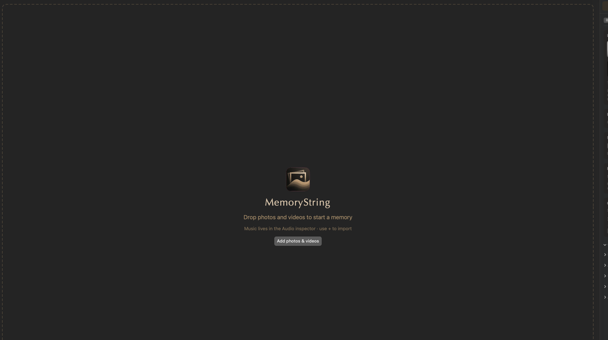

# Quick start

Photos in, Play, Export — a finished movie in a few minutes. Prefer a guided tour? **Help → Show Walkthrough**, or [watch the demos](../welcome.md#watch-a-demo).

## 1. Start a project

Blank stage or an old `.memorystring` — either way you’re editing a real project file.

- **File → New** (**⌘N**), or **⌘W** to clear the current document (the traffic-light close does **not** quit — reopen from the Dock).
- **File → Open…** (**⌘O**), **Open Recent**, or drop a `.memorystring` file onto the window.
- Autosave runs once a file exists. **⌘S** / **⇧⌘S** anytime. **⌘Q** prompts to save untitled work.

## 2. Import media

Fill the **Library** on the left — the cast of the movie.

1. Toolbar **+** → **Photos & Videos…**, or **File → Import Media…**
2. Or drop folders, photos, or videos onto the window.

**Photos:** `.jpg` / `.jpeg` / `.jfif`, `.png`, `.heic` / `.heif`, `.tif` / `.tiff`, `.webp`, `.bmp`, `.gif`  
**Videos:** `.mp4`, `.mov`, `.m4v`, `.avi`, `.mkv`, `.mpg` / `.mpeg`, `.m2v`

Other types are skipped.

After import, MemoryString may offer **Keep Best Shots** when similar photo groups show up. Videos are **not** auto-trimmed — right-click a clip → **Auto Trim**, or Library **⋯**. See [Auto detection](../auto-detection.md#keep-best-shots).

## 3. Order the story

Drag Library thumbnails or Timeline clips until the order feels like the day you lived. The **Intro** slide stays first when it is on.

Library calendar menu: **Oldest First (Story Order)**, **Newest First**, **Import Order**, or **Shuffle**. **Edit → Sort by Date Taken** is the three date/import choices only. In Essential, a first import auto-sorts **Oldest First** when the Library was empty.

Full detail — including Shuffle Transitions, replacing a seat, and reordering **inside** a group: [Organizing](../organizing.md).

## 4. Preview

**Space** (or the toolbar Play/Pause). Click or drag the playhead to scrub. See [Preview](../preview.md#playback).

## 5. Music

Soundtrack lives in Inspector → **Audio**, not the Library.

After the first photos land, **Match Look Soundtrack** (on by default) soft-seeds bundled tracks. Toolbar **+** → **Music…** or **Royalty-Free Library…**. See [Music](../music.md#match-look-soundtrack).

## 6. Polish (optional)

Inspector (**⌥⌘I**) when you want more than the defaults:

- **Style** — Look, Energy, Stage, Photo Size, Captions, Customize… (Studio)
- **Intro** — opening card
- **Motion** — Studio only: Transitions Mix and multi-photo groups
- **Audio** — playlist
- **Format** — aspect / Social Safe

## 7. Export

Toolbar **Export** or **File → Export Movie…** (**⌘E**). Confirm format, resolution, quality (Compact / Share / High / Best — both modes; Studio also shows Mbps), and frame rate, then **Export**. Wait for **Creating memory…**.

You get an H.264 MP4.
