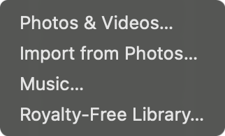

# Quick start

Photos in, Play, Export — a finished movie in a few minutes. Prefer a guided tour? **Help → Show Walkthrough** (marks sit on the live **+**, Essential/Studio, and **Export** controls in the title bar), or [watch the demos](../welcome.md#watch-a-demo).

## 1. Start a project

Blank stage or an old `.memorystring` — either way you’re editing a real project file.

- **File → New** (**⌘N**), or **⌘W** to clear the current document (the traffic-light close does **not** quit — reopen from the Dock).
- **File → Open…** (**⌘O**), **Open Recent**, or drop a `.memorystring` file onto the window.
- Autosave runs once a file exists. **⌘S** / **⇧⌘S** anytime. **⌘Q** prompts to save untitled work.

## 2. Import media

Fill the **Library** on the left — the cast of the movie. MemoryString **links to the original files**; it does not copy your camera roll into the show (a screenshot or other paste with no file behind it is the exception).

1. Toolbar **+** → **Photos & Videos…**, or **File → Import Media…**
2. Or **File → Import from Photos…** (also on **+**) — **Recent**, **Albums**, **People**, **By Month**, **Trips & Events**, **Media Type**

3. Or drop folders, photos, or videos onto the window (or a Photos.app drag).
4. Or drop a folder / paste (**⌘V**).

Empty Library says **Nothing in library yet**; the preview plate takes the drop (hover pulse **Let the story begin**; a `.memorystring` hover reads **The plot thickens**). While **The story begins…** (first import may show a percent and **Cancel**) or **The story continues…** (opening a project, no percent) is up, drops are ignored. After a populated show, a media drop reads **Add to story**. **Keep Best Shots** waits until fog has cleared.

**Photos:** `.jpg` / `.jpeg` / `.jfif`, `.png`, `.heic` / `.heif`, `.tif` / `.tiff`, `.webp`, `.bmp`, `.gif`  
**Videos:** `.mp4`, `.mov`, `.m4v`, `.avi`, `.mkv`, `.mpg` / `.mpeg`, `.m2v`

Other types are skipped.

After import, MemoryString may offer **Keep Best Shots** when similar photo groups show up — extras move to **Outtakes**. Videos are **not** auto-trimmed — right-click a clip → **Auto Trim**, or Library **⋯**. See [Auto detection](../auto-detection.md#keep-best-shots).

## 3. Order the story

Drag Library thumbnails or Timeline clips until the order feels like the day you lived. The **Intro** slide stays first when it is on. The Library’s right edge snaps to whole columns of cards.

Library calendar menu: **Oldest First (Story Order)**, **Newest First**, **Import Order**, or **Shuffle**. **Edit → Sort by Date Taken** is the three date/import choices only. In Essential, a first import auto-sorts **Oldest First** when the Library was empty.

Full detail — including Shuffle Transitions, replacing a seat, and reordering **inside** a group: [Organizing](../organizing.md).

## 4. Preview

**Space** (or the toolbar Play/Pause). Click or drag the playhead to scrub. Hover the Timeline **photo lane** to peek; lift off and that moment sticks. See [Preview](../preview.md#playback).

## 5. Music

Soundtrack lives in Inspector → **Audio**, not the Library.

After the first photos land, **Match Look Soundtrack** (on by default) soft-seeds bundled tracks from that Look’s mood pool. **Pick New Music**, **Extend to Fill**, and **Surprise me** sit under the playlist. Toolbar **+** → **Music…** or **Royalty-Free Library…**. See [Music](../music.md#match-look-soundtrack).

## 6. Polish (optional)

Inspector (**⌥⌘I**) when you want more than the defaults:

- **Style** — Look, Energy, Stage, Photo Size, Captions, Customize (Studio)
- **Intro** — opening card
- **Motion** — Studio only: Transitions Mix and multi-photo groups
- **Audio** — playlist, **Pick New Music** / **Extend to Fill** / **Surprise me**
- **Format** — aspect / Social Safe (Instagram first among Social swatches)

## 7. Export

Toolbar **Export** or **File → Export Movie…** (**⌘E**). Confirm format, resolution, quality (Compact / Share / High / Best — both modes; Studio also shows Mbps), and frame rate, then **Export**. Check **Screensaver** if the file is a looping display movie (no audio, skips intro). Wait for **Creating memory…**.

You get an H.264 MP4. Every share movie ends with a **Created with MemoryString** credit — the app is free, and that mark is how it reaches more families.
