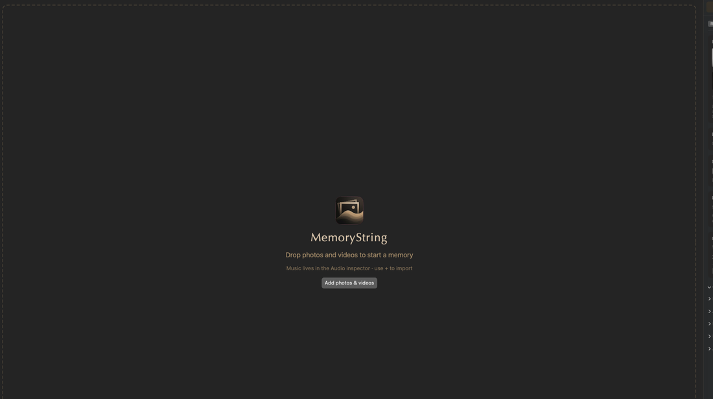
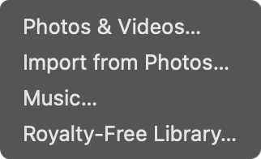
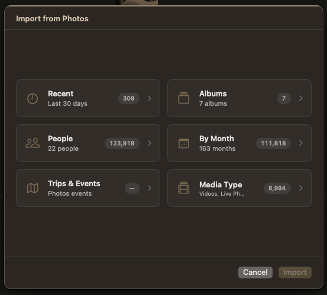
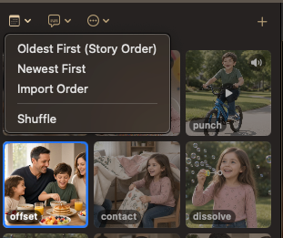

# Quick start

This guide gets you from empty project to exported movie in a few steps. For a guided tour, use **Help → Show Walkthrough**, or [watch the demos](../welcome.md#watch-a-demo).

## 1. Start a project

You always edit a `.memorystring` project file.

- **File → New** (**⌘N**), or **⌘W** to close the current document. The red close button does not quit the app. Reopen from the Dock.
- **File → Open…** (**⌘O**), **Open Recent**, or drop a `.memorystring` file on the window.
- The app autosaves after you save once. Use **⌘S** / **⇧⌘S** anytime. **⌘Q** asks to save untitled work.

## 2. Import media

Imported photos and videos appear in the **Library** on the left.

Folder and Finder imports stay **linked** to the original files. Media from **Photos.app** is **copied** into Application Support **Imports** because Photos does not allow stable links. Pasted screenshots with no file are copied the same way. See [Library](../library.md#import).

1. Toolbar **+** → **Photos & Videos…**, or **File → Import Media…**
2. Or **File → Import from Photos…** (also on **+**) — **Recent**, **Albums**, **People**, **By Month**, **Trips & Events**, **Media Type**

3. Or drop folders, photos, or videos on the window (including from Photos.app).
4. Or drop a folder, or paste (**⌘V**).

An empty **Library** shows **Nothing in library yet**. The preview area accepts drops. Hover hint for media: **Gather the thread**. Hover hint for a project file: **Bring back memories**.

While the stage loader runs, drops are ignored. First import title: **Stringing it together...** (may show percent and **Cancel**). Opening a project: **It's coming back now...** (no percent). The loader is a spinner with a smoke animation.

After the show has clips, a media drop reads **Add to story**. **Keep Best Shots** waits until the loader clears.

**Photos:** `.jpg` / `.jpeg` / `.jfif`, `.png`, `.heic` / `.heif`, `.tif` / `.tiff`, `.webp`, `.bmp`, `.gif`  
**Videos:** `.mp4`, `.mov`, `.m4v`, `.avi`, `.mkv`, `.mpg` / `.mpeg`, `.m2v`

Other types are skipped.

After import, **Keep Best Shots** may appear when similar photo groups are found. Extras move to **Outtakes**. Videos are **not** auto-trimmed on import. Right-click a clip → **Auto Trim**, or use Library **⋯**. See [Auto detection](../auto-detection.md#auto-trim).

## 3. Order the story

Drag **Library** thumbnails or **Timeline** clips until the order feels right. The **Intro** slide stays first when it is on. The **Library** divider snaps to whole columns of cards.

**Library** calendar menu: **Oldest First (Story Order)**, **Newest First**, **Import Order**, or **Shuffle**. **Edit → Sort by Date Taken** offers the three date/import choices only. In **Essential**, a first import auto-sorts **Oldest First** when the **Library** was empty.

More detail: [Organizing](../organizing.md).

## 4. Preview

Press **Space** or use toolbar **Play/Pause**. Click or drag the playhead to scrub. Hover the **Timeline** photo lane to peek. See [Preview](../preview.md#playback).

## 5. Music

Soundtrack lives in Inspector → **Audio** and on the **Audioline**, not in the **Library**.

After the first photos land, **Match Look Soundtrack** (on by default) adds bundled tracks from the current **Look** mood pool. Use **Pick New Music**, **Extend to Fill**, and **Surprise me** under the playlist. Toolbar **+** → **Music…** or **Royalty-Free Library…**.

To trim a song, select it on the **Audioline**, scrub to the moment you want, then **Set Start Here** / **Set End Here**. See [Music](../music.md#audition-the-audioline).

## 6. Polish (optional)

Open the Inspector (**⌥⌘I**) for more control:

- **Style** — Look, Energy, Stage, Photo Size, Captions, Customize (Studio)
- **Intro** — opening card
- **Motion** — Studio only: Transitions Mix, multi-photo groups
- **Audio** — playlist, **Pick New Music** / **Extend to Fill** / **Surprise me**
- **Format** — aspect / Social Safe (Instagram first among Social swatches)

## 7. Export

Toolbar **Export** or **File → Export Movie…** (**⌘E**). Choose format, resolution, quality (Compact / Share / High / Best), and frame rate. Click **Export**. Check **Screensaver** for a looping display movie (no audio, skips intro). Wait for **Creating memory…**.

You get an H.264 MP4. Share movies end with a **Created with MemoryString** credit. The app is free, and the credit helps more people find it.
