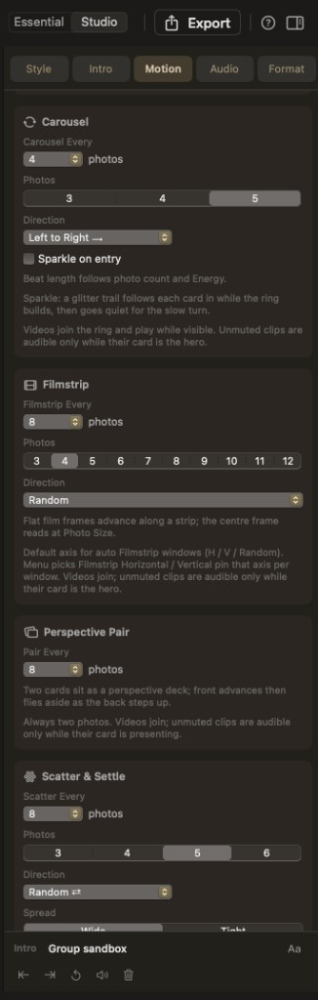

# Multi-photo groups

Several photos or videos as one beat. On/off is always **Motion → Transitions Mix → Multi-photo**. Sections below that hold cadence, count, and direction.

New projects: **Photo Stacks, Carousel, and 3D Ribbon on**; **Filmstrip**, **Perspective Pair**, and **Scatter & Settle** off until you enable them or pick a Look that opts in. Looks set their own cadence (every Look enables Perspective Pair; every Look except **Clean** opts in Scatter & Settle; **Vintage**, **Cinematic**, **Noir**, **B&W**, and **Crisp** opt in Filmstrip).

Each featured beat inside a group is **72.5%** of a single slide’s hero time. Groups keep at least **two** normal slides between windows. Carousel, 3D Ribbon, and Filmstrip also keep at least **four** normal slides between consecutive *travel* windows.

With two or more kinds on, one planner lays out every window: kinds take turns (widest first), a non-travel kind lands between travel kinds when it can, and windows spread evenly. Each kind’s “every N” votes on **one shared rhythm**. **Shuffle Transitions** keeps count/cadence but scatters gaps.

Once you rearrange slides by hand, windows are **pinned** to those photos. Sorting, shuffling, resetting, or changing cadence / count hands placement back to the planner.

Right-click two or more selected clips → **Group Transition**; **Change Transition** or **Ungroup** on an existing group. See [Library](../library.md).

Videos that fit a window play through it; shorter clips hold the first frame until that seat’s hero approach, then play. Unmuted clip audio is audible only while that card is the hero.

## Photo Stacks

- **Stack Every** — 3…8 (default 4)
- **Stack Size** — 3, 4, or 5 cards (default 4)

Fanned cards; faded Ken Burns washes behind (soft crossfade every couple of presents), coloured by Style **Backdrop**.

## Carousel

- **Carousel Every** — 3…8 (default 4)
- **Photos** — 3, 4, or 5 seats (default 5)
- **Direction** — Left to Right / Right to Left / Random (default)

Cards join a turning ring from the incoming side, one revolution, then peel off. Beat length follows seat count and Energy. Front card matches single-slide size; sides foreshorten.

## 3D Ribbon

- **Ribbon Every** — 3…8 (default 5)
- **Photos** — 4 / 5 / 6 (default 5)
- **Direction** — Left to Right / Right to Left / Random (default)

Open belt; one hero at a time, flanks beside it. Spacing breathes with Photo Size.

## Perspective Pair

- **Pair Every** — 3…8 (default 6)
- Always **two** photos

Cover-flow deck: front advances to Photo Size, then flies aside as the back becomes the hero.

## Filmstrip

- **Filmstrip Every** — 3…8 (default **6**)
- **Photos** — 4 / 5 / 6 (default **5**)
- **Direction** — Horizontal / Vertical / Random (seeded per window; default Random)

Off for new projects until you enable it or pick a Look that opts in (**Vintage**, **Cinematic**, **Noir**, **B&W**, **Crisp**).

Flat perforated strip; centre hero at Photo Size. Distinct from Ribbon (depth belt) and Carousel (orbit).

## Scatter & Settle

- **Scatter Every** — 3…8 (default 6)
- **Photos** — 3…6 (default 5)
- **Direction** — From Left / From Right / Random
- **Spread** — Wide or Tight
- **Throw** — Mild / Medium / Full
- **Speed** — Gentle / Normal / Snappy

Cards throw in, land scattered, come forward in timeline order, then throw off the other side. Waiting cards stay opaque (dimmed, softly blurred). The next slide crossfades only after the last card has left.

Look feel (Help): Polaroid tosses often into a tight pile; Vintage and B&W lay prints out mildly; Noir stays restrained; Golden Hour a soft warm toss; Cinematic throws full and wide; Crisp snaps.

## When to use it

- **Stacks** — lively, album-style fanned cards
- **Carousel** — a cinematic tilted orbit
- **3D Ribbon** — an open waving belt, one hero at a time
- **Perspective Pair** — a two-card cover-flow deck
- **Filmstrip** — flat H/V frames along a strip
- **Scatter & Settle** — Polaroids tossed onto the stage
- **All off** — classic one-slide-at-a-time, cut with **Single slides**

## Timeline / Library

Follower slides collapse onto the lead cell. Library badges: **stack 1/5**, **carousel 2/5**, **ribbon 5/5**, **pair 1/2**, **filmstrip 3/5**. Mix checkboxes and group knobs undo with **⌘Z**.
