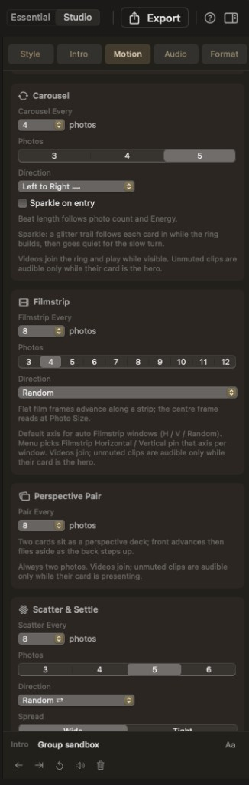
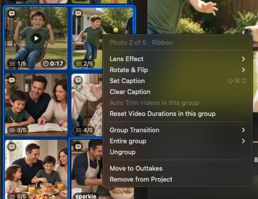
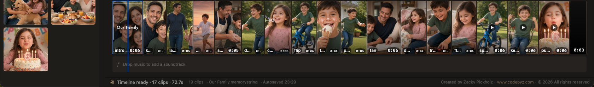

# Multi-photo groups

Sometimes several photos share one moment — stacks, carousels, ribbons, and similar layouts. Turn types on under **Motion → Transitions → Multi-photo**.

New projects: **Photo Stacks, Carousel, and 3D Ribbon on**; **Filmstrip**, **Perspective Pair**, and **Scatter & Settle** off until you enable them or pick a Look that turns them on.

Each hero moment inside a group uses about **72.5%** of a normal slide’s time. Groups need at least **two** normal slides between windows. **Carousel**, **3D Ribbon**, and **Filmstrip** also keep at least **four** normal slides between travel-style windows.

With several kinds on, one planner places windows evenly. **Shuffle Transitions** keeps counts but changes positions.

If you drag slides by hand, group windows **pin** to those photos until you sort, shuffle, reset, or change cadence.

Right-click a grouped photo for **that seat**. **Entire group ▸** (near **Ungroup**) applies rotate, lens, duration, or move/remove to all seats. Right-click two or more singles → **Group Transition**. See [Library](../library.md#right-click-a-slide).

Videos in a group play in their seat. Unmuted video audio plays only while that card is the hero.

## Photo Stacks

- **Stack Every** — 3…8 (default 4)
- **Stack Size** — 3, 4, or 5 cards (default 4)

Fanned pile with backdrop washes behind.



## Carousel

- **Carousel Every** — 3…8 (default 4)
- **Photos** — 3, 4, or 5 seats (default 5)
- **Direction** — Left to Right / Right to Left / Random

Cards join a ring, rotate, then leave.



## 3D Ribbon

- **Ribbon Every** — 3…8 (default 5)
- **Photos** — 4 / 5 / 6 (default 5)
- **Direction** — Left to Right / Right to Left / Random

Depth belt with one hero at a time.



## Perspective Pair

- **Pair Every** — 3…8 (default 6)
- Always **two** photos

Two-card cover flow: front becomes hero, then moves aside.



## Filmstrip

- **Filmstrip Every** — 3…8 (default **6**)
- **Photos** — 4 / 5 / 6 (default **5**)
- **Direction** — Horizontal / Vertical / Random

Flat strip with center hero at Photo Size.



## Scatter & Settle

- **Scatter Every** — 3…8 (default 6)
- **Photos** — 3…6 (default 5)
- **Direction** — From Left / From Right / Random
- **Spread** — Wide or Tight
- **Throw** — Mild / Medium / Full
- **Speed** — Gentle / Normal / Snappy

Cards throw in, land, step forward in order, then throw off.



## When to use it

- **Stacks** — fanned album pile
- **Carousel** — rotating ring of cards
- **3D Ribbon** — depth belt, one hero
- **Perspective Pair** — two-card deck
- **Filmstrip** — horizontal or vertical strip
- **Scatter & Settle** — tossed cards on stage
- **All off** — one photo at a time with single-slide transitions

## Timeline / Library

Follower slides collapse onto the lead cell. Badges: **stack 1/5**, **carousel 2/5**, **ribbon 5/5**, **pair 1/2**, **filmstrip 3/5**, **scatter 2/5**. Caption bubble on the **captioned seat** only.

**This photo** **Lens Effect** pins one seat. **Entire group ▸ Lens** copies to every seat. **Anamorphic Streaks** and **Bokeh** do not auto-assign on group seats — pin by hand if you want them.

After seat changes, the strip may show **Preparing preview…** while the group rebuilds. Transition and group settings undo with **⌘Z**.
