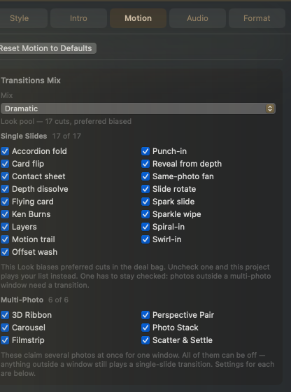

# Transitions

Inspector → **Motion** (Studio). **Transitions Mix** is the list of everything this project may play.

**Reset Motion to Defaults** restores mix, checkboxes, and group settings. Slide order and durations stay.

## Mix presets

**Varied · Gentle · Playful · Dramatic**

Every mix owns the **full** single-slide vocabulary; the preset only **biases** how often each lands.

- **Varied** — even share
- **Gentle** — leaning Ken Burns, depth dissolve, reveal from depth, same-photo fan
- **Playful** — leaning flip, slide, spark slide, sparkle wipe, flying card, swirl-in
- **Dramatic** — leaning punch-in, spiral-in, accordion, swirl-in

Picking a mix (or a **Look** chip) hands choice back and clears hand-picked checkboxes. Energy never clears them. Any change here → **Custom**.

## Single slides

At least **one** single-slide box stays on. The checklist in the app (currently **17 of 17** when all are on):

Accordion fold, Card flip, Contact sheet, Depth dissolve, Flying card, Ken Burns, Layers, Motion trail, Offset wash, Punch-in, Reveal from depth, Same-photo fan, Slide rotate, Spark slide, Sparkle wipe, Spiral-in, Swirl-in

**Spiral-in** and **Reveal from depth** take about five seconds to seat. Above roughly **93% Energy** they cannot play (boxes dim). If they were the only kinds checked, the movie falls back to Ken Burns while Energy stays that high.

## Multi-photo

**3D Ribbon, Carousel, Filmstrip, Perspective Pair, Photo Stack, Scatter & Settle**

These are on/off switches. All six may be off (classic one-at-a-time). Unchecking one keeps its cadence settings and shows *Off — check … under Transitions Mix…*. Details: [Multi-photo groups](groups.md).
