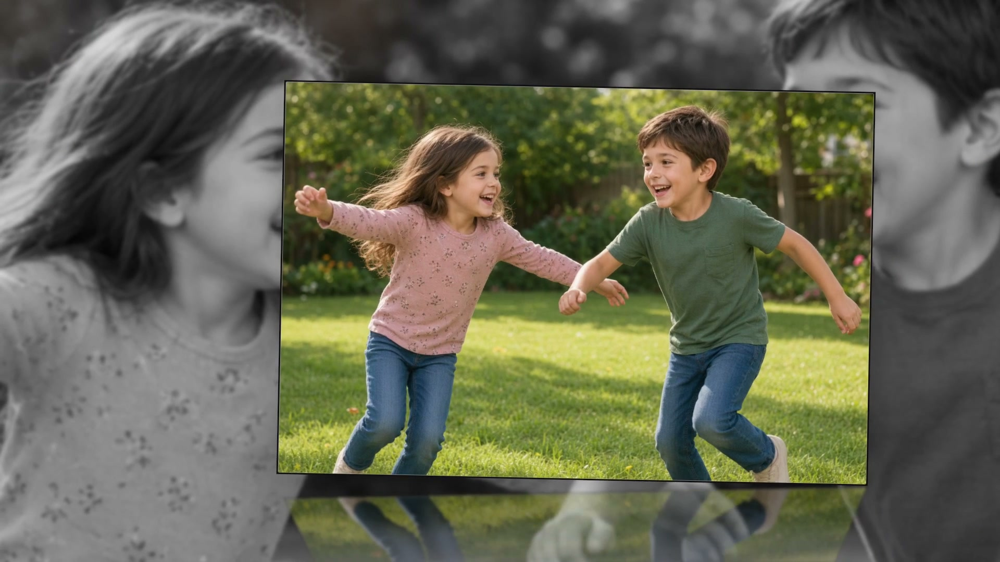
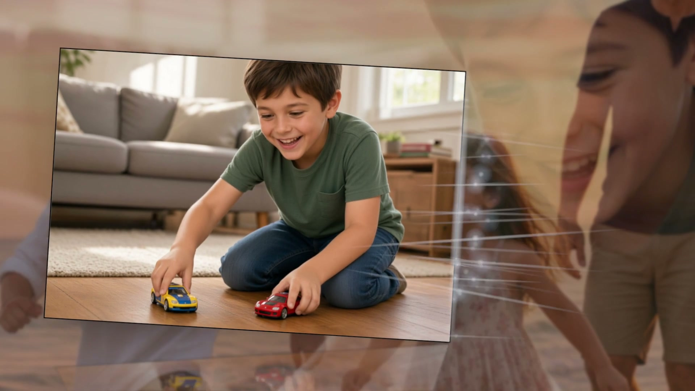
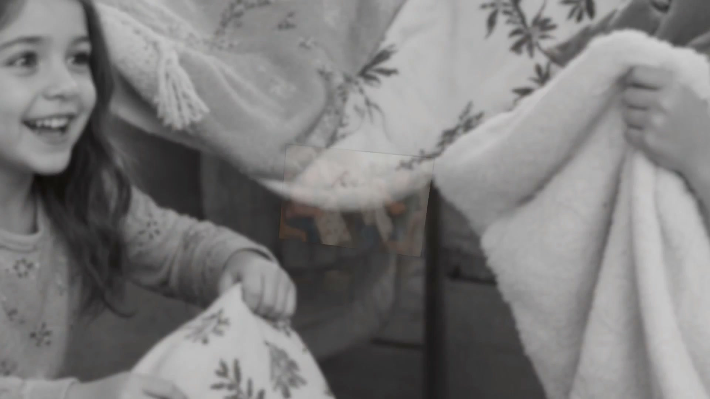

# Transitions

Inspector → **Motion** (Studio). **Transitions Mix** is the list of everything this project may play.

**Reset Motion to Defaults** restores mix, checkboxes, and group settings. Slide order and durations stay.

## Mix presets

**Varied · Gentle · Playful · Dramatic**

Every mix owns the **full** single-slide vocabulary; the preset only **biases** how often each lands.

- **Varied** — even share
- **Gentle** — leaning Ken Burns, depth dissolve, reveal from depth, same-photo fan
- **Playful** — leaning flip, slide, spark slide, sparkle wipe, flying card, swirl-in
- **Dramatic** — leaning punch-in, spiral-in, accordion, swirl-in

Picking a mix (or a **Look** chip) hands choice back and clears hand-picked checkboxes, then re-deals cuts. Changing the mix re-cuts photos whose current kind the new mix does not use; photos already on a kind it keeps stay put. Energy never clears your picks. Any change here → **Custom**. Style then says *Set in Motion* if you tick boxes by hand.

## Single slides

At least **one** single-slide box stays on. The checklist in the app (currently **17 of 17** when all are on). Each clip below is 1080p from a real export; the still is the video cover.

### Ken Burns

Unbroken lean-in toward the focus point.

<figure><figcaption>Ken Burns</figcaption></figure>



### Depth dissolve

Swims up out of blur and back, held square — softens automatically on a light stage.

<figure><figcaption>Depth dissolve</figcaption></figure>



### Layers

Overlapping ghost layers on the hand-off.

<figure><figcaption>Layers</figcaption></figure>



### Card flip

Edge-on flip — fades in, turns face-front, mirror exit.

<figure><figcaption>Card flip</figcaption></figure>



### Slide rotate

Polaroid slides in from off-stage, glides, slides out.

<figure><figcaption>Slide rotate</figcaption></figure>



### Spark slide

Polaroid skates in and off; a spark trail through the flight.

<figure><figcaption>Spark slide</figcaption></figure>



### Sparkle wipe

Glitter trail while the next print skates in.

<figure><figcaption>Sparkle wipe</figcaption></figure>



### Flying card

Card tossed through 3D space.

<figure><figcaption>Flying card</figcaption></figure>



### Offset wash

Split seat — card one side at Photo Size; wash opposite.

<figure><figcaption>Offset wash</figcaption></figure>



### Punch-in

Oversized smear in, then punches past the lens.

<figure><figcaption>Punch-in</figcaption></figure>



### Spiral-in

Card coils in; wash zooms in then out.

<figure><figcaption>Spiral-in</figcaption></figure>



### Reveal from depth

Slow push forward out of distant blur.

<figure><figcaption>Reveal from depth</figcaption></figure>



### Accordion fold

Closed bellows unfold while fading in, then fold shut.

<figure><figcaption>Accordion fold</figcaption></figure>



### Contact sheet

Bright Photo Size print on a dimmed grid of the same photo.

<figure><figcaption>Contact sheet</figcaption></figure>



### Same-photo fan

One photo fanned in depth — center sharp, soft dim wings.

<figure><figcaption>Same-photo fan</figcaption></figure>



### Motion trail

Print with a diagonal motion-trail echo.

<figure><figcaption>Motion trail</figcaption></figure>



### Swirl-in

Card spirals in and out; wash zooms (wash does not swirl).

<figure><figcaption>Swirl-in</figcaption></figure>



**Spiral-in** and **Reveal from depth** take about five seconds to seat. Captions wait until the photo has nearly landed. Only **Varied** carries both in its bias; **Gentle** leans Reveal, **Dramatic** leans Spiral, **Playful** leans neither — or tick them in Motion. By Look: Clean, Vintage, Noir, B&W, Golden Hour are Gentle; Cinematic and Crisp are Dramatic; Polaroid is Playful.

Above roughly **93% Energy** they cannot play (boxes dim). If they were the only kinds checked, the movie falls back to Ken Burns while Energy stays that high. Once stills drop under about four seconds (~93% Energy), mixes drop both for quicker cuts.

Per-slide pick: right-click → **Slide Transition** (includes **Random**). See [Library](../library.md).

## Multi-photo

**3D Ribbon, Carousel, Filmstrip, Perspective Pair, Photo Stack, Scatter & Settle**

These are on/off switches. All six may be off (classic one-at-a-time). Unchecking one keeps its cadence settings and shows *Off — check … under Transitions Mix…*. Details: [Multi-photo groups](groups.md).
