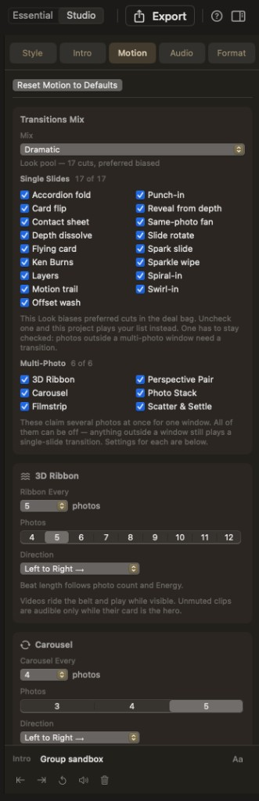

# Transitions

Transitions control how each photo enters and leaves. In **Studio**, open Inspector → **Motion**. **Transitions Mix** lists what this project can use.

**Reset Motion to Defaults** restores mix, checkboxes, and group settings. Slide order and durations stay.

## Mix presets

**Varied · Gentle · Playful · Dramatic** — each mix can use the full set of single-slide transitions. The preset changes how often each type appears.

- **Varied** — even mix
- **Gentle** — more Ken Burns, depth dissolve, reveal from depth, same-photo fan
- **Playful** — more flip, slide, spark slide, sparkle wipe, flying card, swirl-in
- **Dramatic** — more punch-in, spiral-in, accordion, swirl-in

Changing mix or clicking a **Look** re-deals transitions. Photos already using a kind the new mix includes may keep that kind. Energy does not clear your checkbox picks. Manual checkbox edits show **Custom** in Style (*Set in Motion*).

## Single slides

One photo at a time. At least **one** transition type stays on. The app lists **17** single-slide types when all are enabled.

### Ken Burns

Slow zoom toward the focus point.



### Depth dissolve

Photo sharpens from blur.



### Layers

Outgoing photo fades while the next appears.



### Card flip

Card flips in and out.



### Slide rotate

Card slides in from off-screen and slides out.



### Spark slide

Card slides with a spark trail.



### Sparkle wipe

Glitter trail as the next photo arrives.



### Flying card

Card moves through 3D space.



### Offset wash

Photo on one side, color wash on the other.



### Punch-in

Fast zoom through the frame.



### Spiral-in

Card spirals in; wash zooms.



### Reveal from depth

Photo pushes forward out of blur.



### Accordion fold

Fold animation in and out.



### Contact sheet

One sharp photo on a dim grid of the same image.



### Same-photo fan

One photo with soft side copies.



### Motion trail

Photo moves with a motion echo.



### Swirl-in

Card spirals in and out.



**Spiral-in** and **Reveal from depth** take about five seconds. Captions wait until the photo nearly lands. At high **Energy** (~93%+), they cannot play. Enable them in **Motion** if your mix allows.

Per-slide pick: right-click → **Slide Transition** (includes **Random**). See [Library](../library.md#right-click-a-slide).

## Multi-photo

Several photos in one beat — **3D Ribbon, Carousel, Filmstrip, Perspective Pair, Photo Stack, Scatter & Settle**.

Toggle each type on or off. All six can be off for one-photo-at-a-time shows. Details: [Multi-photo groups](groups.md).
