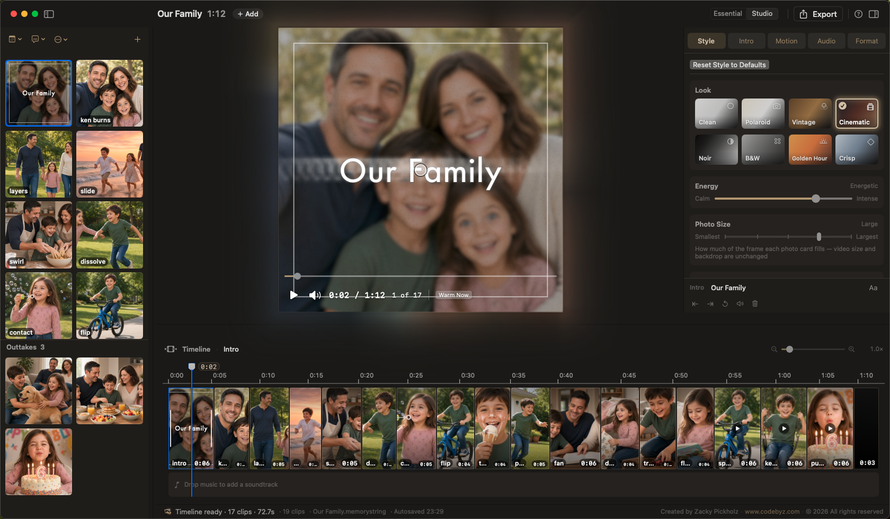
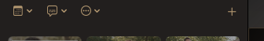

# Organizing the slideshow

Order the photos and videos, then (optionally) re-roll the cuts. The **Intro** slide stays first when it is on — sorts, shuffles, and drags never mix it into the media thumbs.

## Sort and shuffle slides

Library **calendar** menu, **Edit → Sort by Date Taken**, Inspector → **Motion → Timeline** (Studio), or right-click empty Library space:

| Command | What it does |
| --- | --- |
| **Oldest First (Story Order)** | Capture date, oldest → newest |
| **Newest First** | Reverse chronological |
| **Import Order** | The sequence you brought the files in |
| **Shuffle** / **Shuffle Slides** | Random photo order (Motion names it Shuffle Slides). Pauses playback and seeks to the start |

Date sorts use the camera capture date (EXIF / recording date). Only when a file has neither does it fall back to the file date. Files with no date land at the **end**. Filenames are never used.

Captions, trims, and rotations stay with each photo. Groups are **planned fresh**. **⌘Z** undoes a sort or shuffle.

**Essential:** after import, if the Library was empty or already **Oldest First**, new stills auto-sort **Oldest First**. Studio does not.

## Shuffle Transitions

Keeps photo order. Re-rolls single-slide cuts, group kinds, and where group windows sit. Cadence, which group types are on, and card counts stay.

Library **⋯**, Inspector → **Motion → Timeline**, or right-click empty Library space. If you hand-picked **Slide Transition**s, it asks before clearing them.

Clicking a **Look** chip also re-deals transitions (and related Style). See [Looks](style/looks.md).

## Drag to reorder

**Library** — drag thumbs in the grid.

**Timeline** photo lane — drag clips. Near the left or right edge, the strip auto-scrolls so a clip can travel past what is on screen.

Drag from the Library onto the Timeline:

- Drop in a **gap** — insert or move
- Drop on a **single** slide or a **group seat** until **Replace**
- Drop on the **intro** tile — sets the intro background

Music reorders on the **music lane**, not here. See [Music](music.md).

Hand-dragging slides **pins** group windows to those photos. Sorting, shuffling, resetting, or changing cadence / count hands placement back to the planner. See [Multi-photo groups](motion/groups.md).

### Singles vs whole groups

First click on a group selects the **whole window** (champagne outline in the Library; one cell on the Timeline). Drag then moves every seat together.

Right-click two or more selected clips → **Group Transition**. **Ungroup** / **Change Transition** on an existing group. See [Library](library.md).

### In-group photos and videos

Click the group again on a **member** (Library) or a **thumb** on the Timeline cell (second click) to **drill in** to that seat. The accent ring is on one photo.

Drag that seat alone:

- Drop on another **seat** in the same window to swap / replace that place in the group
- Drop in a **gap** to pull it out of the group (extract)

The group **badge** on a Library thumb re-selects the whole window.

## Undo

**⌘Z** undoes sort, shuffle, Shuffle Transitions, and drag reorder. Named in the Edit menu (for example Undo Sort by Date Taken, Undo Shuffle).
