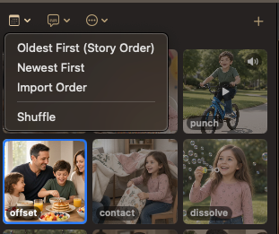
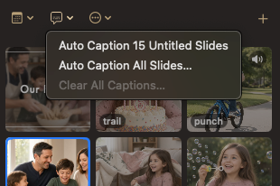
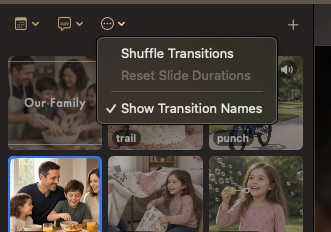
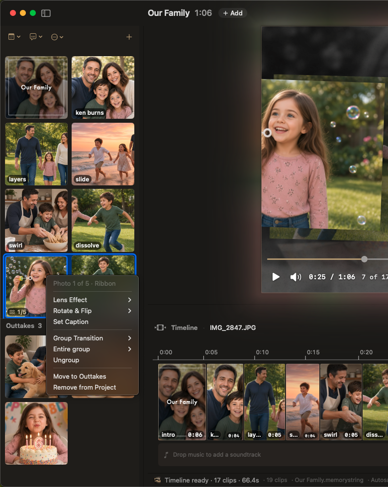

# Organizing the slideshow

A slideshow is a story — Tuesday’s cake after Saturday’s drive, not before. The **Intro** stays first when it is on; sorts, shuffles, and drags never mix it into the media thumbs.

<figure><figcaption>Library — drag thumbs to reorder; drop on a slide or group seat to Replace</figcaption></figure>

<figure><figcaption>Timeline — drag a single clip or a whole group on the photo lane</figcaption></figure>

## Sort and shuffle slides

Trip diary, night-just-ended reverse, or a deliberate surprise — Library **calendar**, **Edit → Sort by Date Taken**, Inspector → **Motion → Timeline** (Studio), or right-click empty Library space:

| Command | What it does |
| --- | --- |
| **Oldest First (Story Order)** | Capture date, oldest → newest |
| **Newest First** | Reverse chronological |
| **Import Order** | The sequence you brought the files in |
| **Shuffle** / **Shuffle Slides** | Random photo order (Motion names it Shuffle Slides). Pauses playback and seeks to the start |

Date sorts use camera capture date (EXIF / recording date); file date only if neither exists. Undated files at the **end**. Filenames never used. Captions, trims, rotations stay; groups **planned fresh**. **⌘Z** undoes.

**Essential:** after import, if the Library was empty or already **Oldest First**, new stills auto-sort **Oldest First**. Studio does not.

## Captions (Library bubble)

Bulk fill or clear — fifty captions by hand is a long evening. Full settings: [Intro and captions](intro-captions.md#slide-captions).

## Shuffle Transitions

Happy with photo order, bored with the cuts? Keeps photo order; re-rolls single-slide cuts, group kinds, and where group windows sit. Cadence, which group types are on, and card counts stay.

Library **⋯**, Inspector → **Motion → Timeline**, or right-click empty Library space. If you hand-picked **Slide Transition**s, it asks before clearing them.

Clicking a **Look** chip also re-deals transitions (and related Style). See [Looks](style/looks.md#the-eight-chips).

## Drag to reorder

When “Grandma next to the kids” beats auto-sort, drag.

**Library** — drag thumbs in the grid.

**Timeline** photo lane — drag clips; near either edge the strip auto-scrolls past what’s on screen.

Drag from the Library onto the Timeline:

- Drop in a **gap** — insert or move
- Drop on a **single** slide or a **group seat** until **Replace**
- Drop on the **intro** tile — sets the intro background

Music reorders on the **music lane**, not here. See [Music](music.md#arrange-on-the-timeline).

Hand-dragging **pins** group windows to those photos. Sorting, shuffling, resetting, or changing cadence / count returns placement to the planner. See [Multi-photo groups](motion/groups.md).

### Singles vs whole groups

First click on a group selects the **whole window** (champagne outline in the Library; one cell on the Timeline). Drag then moves every seat together.

Right-click two or more selected clips → **Group Transition**. **Ungroup** / **Change Transition** on an existing group. See [Library](library.md#right-click-a-slide).

### In-group photos and videos

Blinker out, grin in: click the group again on a **member** (Library) or a **thumb** on the Timeline cell (second click) to **drill in**. Accent ring on one photo — drag that seat alone.

- Drop on another **seat** in the same window to swap / replace that place in the group
- Drop in a **gap** to pull it out of the group (extract)

The group **badge** on a Library thumb re-selects the whole window.

## Undo

Mistakes are cheap. **⌘Z** undoes sort, shuffle, Shuffle Transitions, and drag reorder. Named in the Edit menu (for example Undo Sort by Date Taken, Undo Shuffle).
