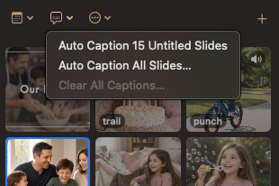
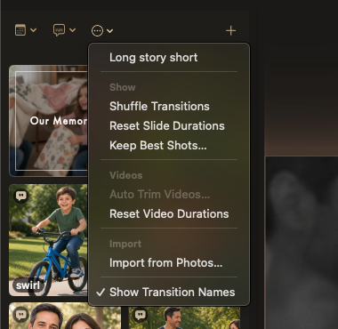

# Organizing the slideshow

Slide order is your story. The **Intro** stays first when it is on. Sort, shuffle, and drag never move the intro among normal slides.

<figure><figcaption>Library — drag thumbs to reorder; drop on a slide or group seat to Replace</figcaption></figure>

<figure><figcaption>Timeline — drag a single clip or a whole group on the photo lane</figcaption></figure>

## Sort and shuffle slides

Use the **Library** **calendar** menu (or right-click empty **Library** space) for sort and **Shuffle**. **Edit → Sort by Date Taken** and **Studio** **Motion → Timeline → Sort by Date Taken** offer the three date/import choices only. **Studio** **Motion** also has **Shuffle Slides**:

| Command | What it does |
| --- | --- |
| **Oldest First (Story Order)** | Capture date, oldest → newest |
| **Newest First** | Newest → oldest |
| **Import Order** | The order files were imported |
| **Shuffle** / **Shuffle Slides** | Random photo order. Pauses playback and seeks to the start |

Date sorts use camera capture date (EXIF / recording date). If missing, file date is used. Undated files go at the **end**. Filenames are not used. Captions, trims, and rotations stay. Groups are planned again. **⌘Z** undoes.

**Essential:** after import, if the **Library** was empty or already **Oldest First**, new stills auto-sort **Oldest First**. **Studio** does not.

## Captions (Library bubble)

Use the captions bubble for bulk fill or clear. Settings: [Intro and captions](intro-captions.md#slide-captions).

## Shuffle Transitions

**Shuffle Transitions** keeps photo order. It picks new single-slide transitions, group types, and group positions. Cadence and group settings stay.

Find it in **Library** **⋯**, Inspector → **Motion → Timeline**, or right-click empty **Library** space. If you set **Slide Transition** by hand, MemoryString asks before clearing those picks.

**Reset Slide Durations** (same menus) restores default still timing.

Clicking a **Look** chip also changes transitions. See [Looks](style/looks.md#the-eight-chips).

## Drag to reorder

**Library** — drag thumbnails in the grid. A group shows as one plate. Drop on the group’s first seat to **join** the group.

**Timeline** photo lane — drag clips. The strip auto-scrolls near the edges. Hover a cell to peek; move off the strip and that moment stays on the preview.

Drag from the **Library** to the **Timeline**:

- Drop in a **gap** — insert or move
- Drop on a **single** slide or **group seat** until **Replace**
- Drop on the **intro** tile — sets the intro background

Music reorders on the **music lane**. See [Music](music.md#arrange-on-the-timeline).

Hand-dragging **pins** group windows to those photos. Sort, shuffle, reset, or cadence changes let the planner place groups again. See [Multi-photo groups](motion/groups.md).

### Singles vs whole groups

First click on a group selects the **whole window**. Drag moves every seat together.

Right-click a grouped photo for **that seat**. **Entire group ▸** holds actions for all seats. Right-click two or more singles → **Group Transition**. **Ungroup** splits a group. See [Library](library.md#right-click-a-slide).

### In-group photos and videos

Click a group again on a **member** (Library) or a **thumb** on the **Timeline** cell to select one seat. Drag that seat alone.

- Drop on another **seat** in the same group to swap
- Drop in a **gap** to pull the photo out of the group
- After seat changes, the strip may show **Preparing preview…** while the group rebuilds

The group **badge** on a **Library** thumb selects the whole window again.

## Undo

**⌘Z** undoes sort, shuffle, **Shuffle Transitions**, drag reorder, **Keep Best Shots**, and **Auto Trim**. The **Edit** menu names the action.

**Keep Best Shots** and **Auto Trim** are under **Library** **⋯**. **Auto Trim** is also on a video’s right-click menu. Keep Best extras go to [Outtakes](library.md#outtakes). See [Auto detection](auto-detection.md#auto-trim).

Right-click a Take → **Move to Outtakes**. Right-click an Outtake → **Move to Takes**. Drag between panes does the same.
