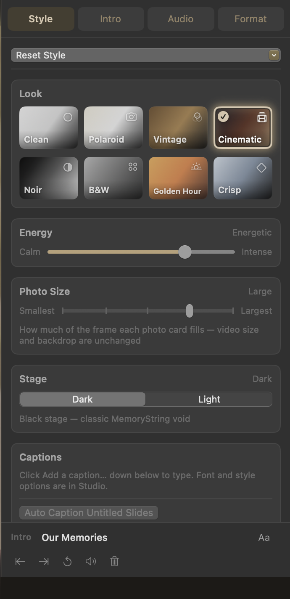
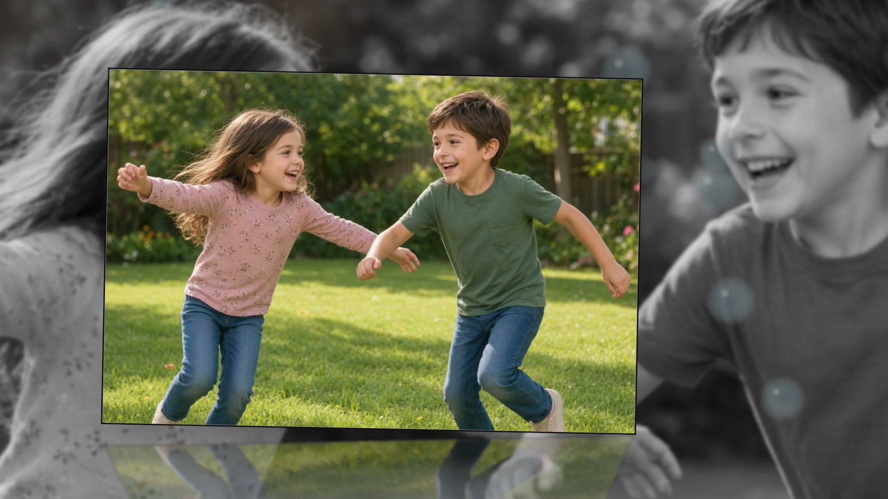
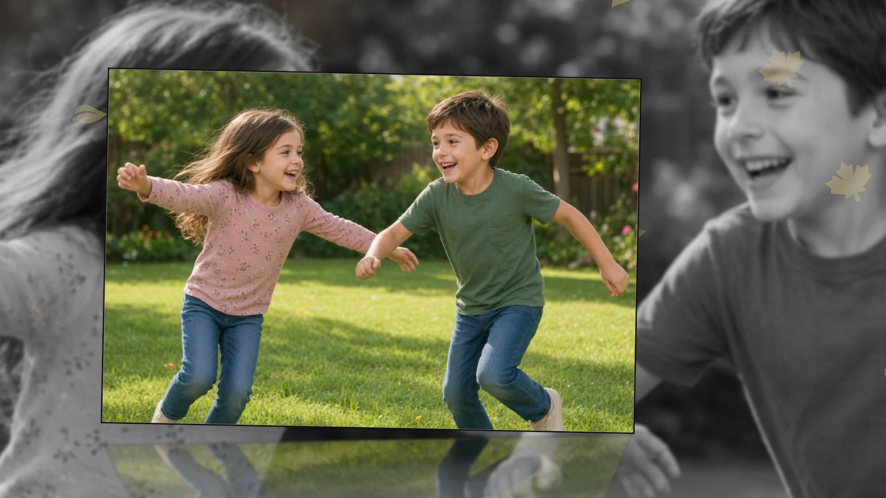
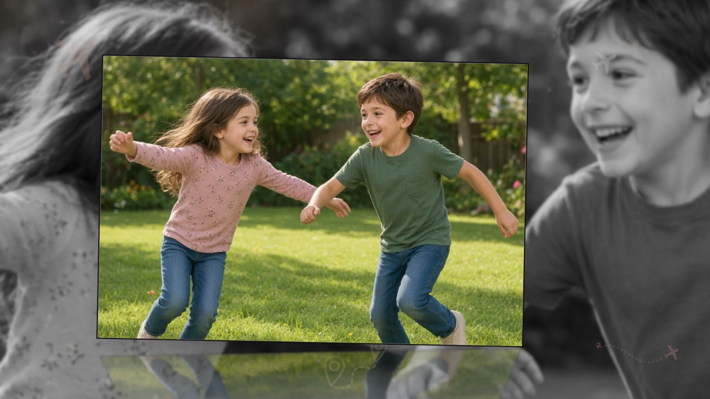
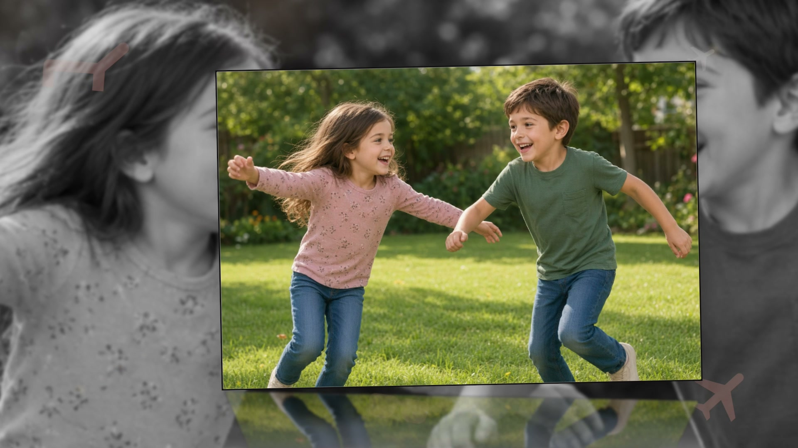
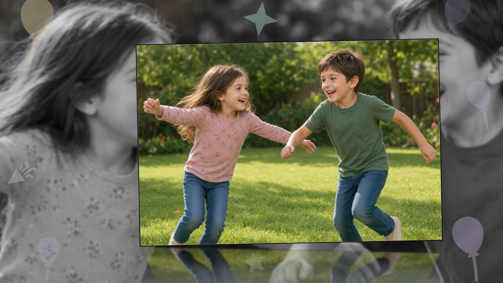
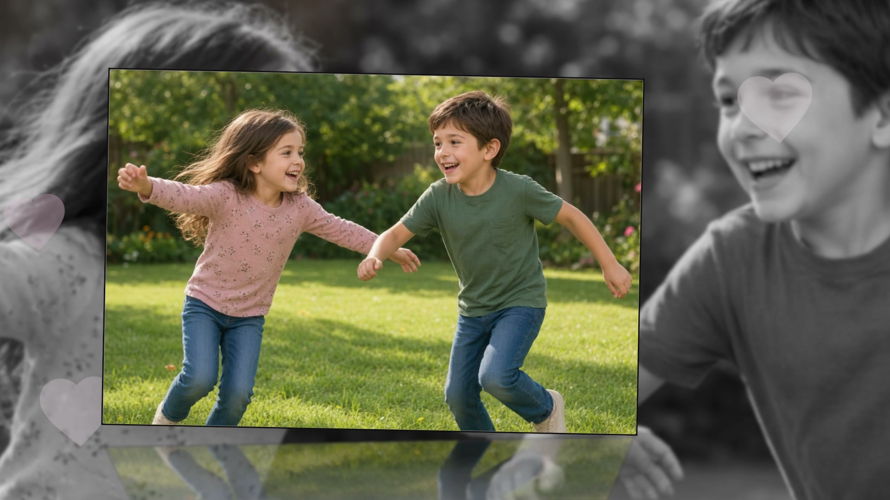
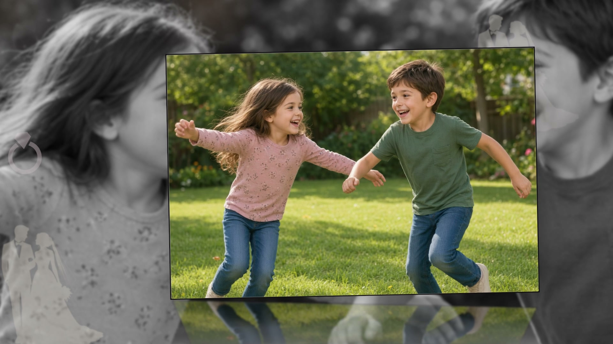
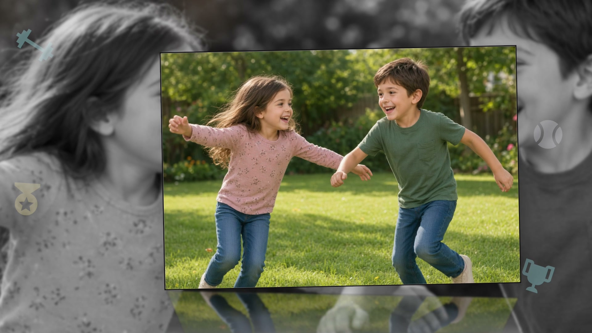

# Customize

Studio only. Inspector → **Style** → **Customize** (open by default in Studio). Each inner block starts **collapsed**:

**Plate · Ambience · Lens Effects · Film · Atmosphere & Decals**

A Look that ticks several lens boxes still plays **at most one** pooled effect per photo. Clicking the **same Look chip again** deals a fresh three (except **Clean**). See [Looks](looks.md).

**Reset Style to Defaults** restores this tab (and caption *style*, not caption *text*). Per-photo film overrides clear too. Tab resets undo with **⌘Z** and never remove photos, music, order, or trims.

## Plate

- **Photo Border** — **White** or **Black** matte; thick white frames get a heavier bottom margin
- **Border Width** and **Border Opacity** — opacity fades the whole matte
- **Torn Edge** + strength — Soft deckle or Rough hand-torn (when not off)
- **Paper Curl**
- **Drop Shadow** — Soft or Strong (also from nearer seats onto ones behind in a stack, carousel, or ribbon)
- **Rim Glow** — Soft or Strong luminous edge (with Drop Shadow or instead of it)
- **Corners** — Rounded / Sharp — sharp for Polaroid / Cinematic / Noir / Crisp; Clean, Vintage, B&W, and Golden Hour stay rounded

## Ambience

- **Floor Reflection** — Soft or Strong mirrored floor (with Drop Shadow / Rim Glow or instead of them)
- **Glow on Entry** — soft warm settle; on a group window the whole open catches it once
- **Wind** — **None**, **Gentle Wind**, or **Light Wind** (paper sway on the hold)
- **Wind Direction** — when Wind is on: **Horizontal**, **Diagonal ↗**, **Diagonal ↘**
- **Light Leak** — amber edge burn (+ Soft Colored accent); burns through group windows too
- **Backdrop** — Grayscale / Colored / Random
- **Backdrop Seat** — Centered / Offset

The backdrop is a blurred, enlarged copy of the photo — including multi-photo flourishes, whose washes crossfade every couple of cards. It drifts with the plate, softens less on Light stage, and settles with the card.

| Backdrop | What it does |
| --- | --- |
| **Grayscale** | Every wash fully mono |
| **Colored** | Every wash keeps the photo’s colours |
| **Random** | About half mono / half colour, **stable per photo seed** — preview matches export |

Older projects migrate: Black & White → Grayscale, Color → Colored, Mixed → Random.

## Lens Effects

Optical light on the frame. Full list, clips, Randomize / How often, and Anamorphic / Refract knobs: **[Lens effects](lens-effects.md)**.

Checkboxes A–Z: **Anamorphic Streaks, Bokeh, Flare, Ghosting, Orbs, 50mm Prime, Pulse, Refract Bubbles, Sparkle, Starburst, Sweep, Veiling Glare, Vignette**, plus **Randomize Selected** and **How often**. A photo plays **at most one** pooled effect.

## Film

Outside the lens pool — never thinned by Randomize.

- **Film Grain** + **Grain Amount** — soft warm stock over the whole frame; sized to the frame so 4K matches preview
- **Color Fringe** + **Fringe Amount** — soft red/blue at photo edges
- **Film Scratches** + **Scratch Amount** — sparse hairlines on the **blurred backdrop only**; photo cards stay clean

With a photo selected, **This Photo** sets each of those to **Inherit**, **Off**, or **On** (plus amount when not Inherit). Per-photo film edits do **not** switch Style to Custom.

## Atmosphere & Decals

Each menu is a **single choice**. Default **None**. Looks never set these. Picking one does not re-deal the lens pool.

- **Atmosphere** — **None** · **Bubbles** (soap films) · **Leaves** (autumn drift + maple edge motifs)
- **Decals** — **None** · **Travel** (pins / routes / folded map / plane / suitcase **plus** a dotted route plane) · **Vacation** (holiday motifs + the same route plane) · **Party** (sparse cues + a sparkle tick) · **Florals** · **Wedding** · **Pets** · **Sports**

All edge-biased, never a sticker bomb on the hero print. There is no separate Map or Route checkbox.

Each clip below is 1080p from a real export with that one choice on; the still is the video cover.

### Atmosphere — Bubbles

<figure><figcaption>Atmosphere · Bubbles</figcaption></figure>



### Atmosphere — Leaves

<figure><figcaption>Atmosphere · Leaves</figcaption></figure>



### Decals — Travel

<figure><figcaption>Decals · Travel</figcaption></figure>



### Decals — Vacation

<figure><figcaption>Decals · Vacation</figcaption></figure>



### Decals — Party

<figure><figcaption>Decals · Party</figcaption></figure>



### Decals — Florals

<figure><figcaption>Decals · Florals</figcaption></figure>



### Decals — Wedding

<figure><figcaption>Decals · Wedding</figcaption></figure>



### Decals — Pets

<figure><figcaption>Decals · Pets</figcaption></figure>



### Decals — Sports

<figure><figcaption>Decals · Sports</figcaption></figure>



