# Lens effects

Studio → **Style → Customize → Lens Effects**. Optical light on the frame. Atmosphere is weather; Decals are stick-on motifs. Checkboxes A–Z (same column-major order as Motion):

**Anamorphic Streaks, Bokeh, Flare, Ghosting, Orbs, 50mm Prime, Pulse, Refract Bubbles, Sparkle, Starburst, Sweep, Veiling Glare, Vignette**

Plus **Randomize Selected** and **How often**. Each clip below is 1080p from a real export with that effect pinned; the still is the video cover.

<figure>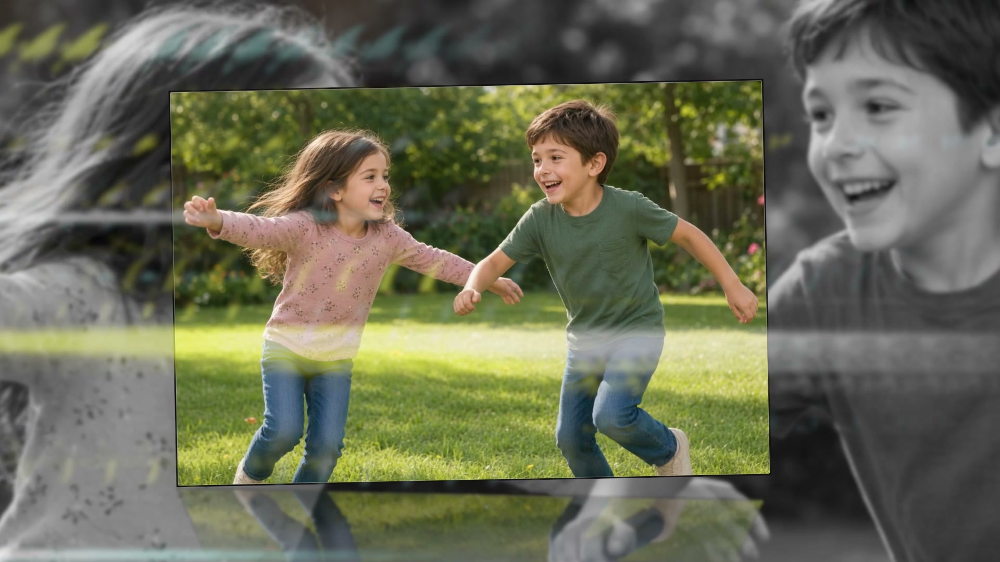<figcaption>Anamorphic Streaks</figcaption></figure>



<figure>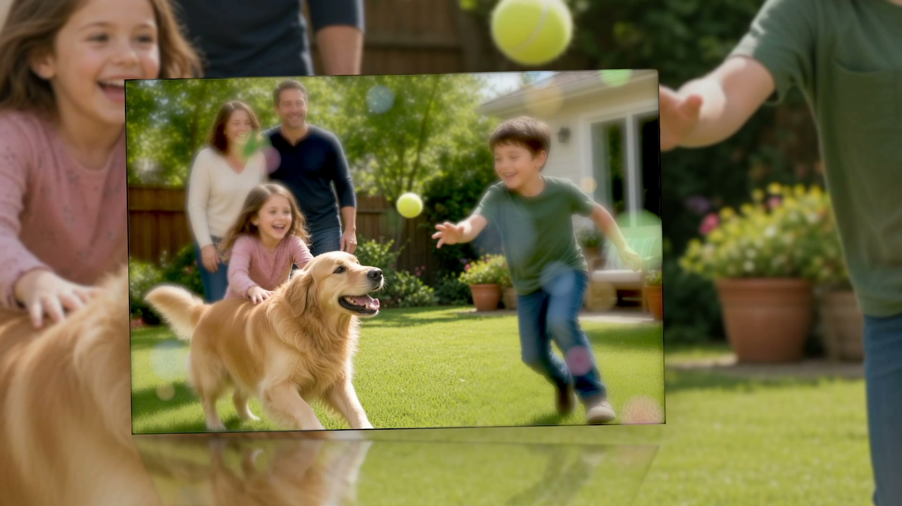<figcaption>Bokeh</figcaption></figure>



<figure>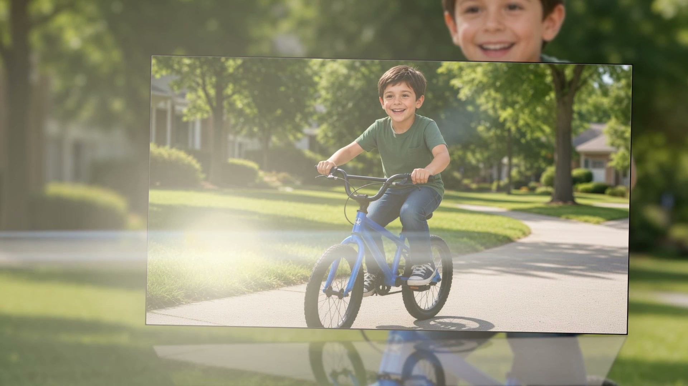<figcaption>Flare</figcaption></figure>



<figure>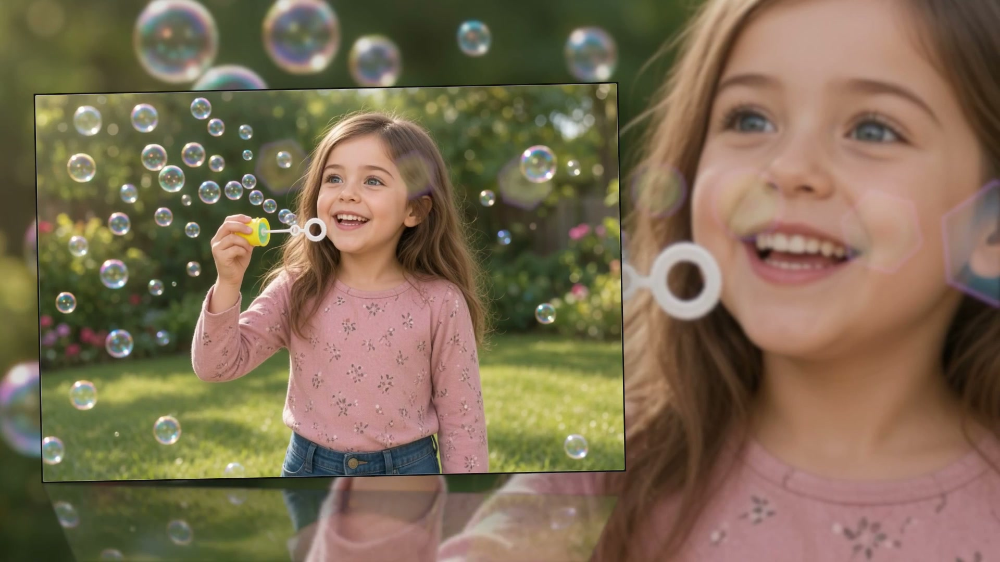<figcaption>Ghosting</figcaption></figure>



<figure><figcaption>Orbs</figcaption></figure>



<figure>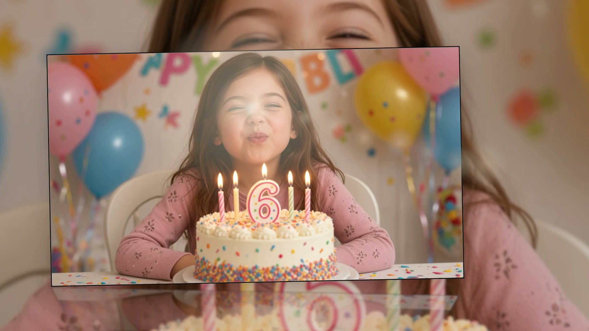<figcaption>50mm Prime</figcaption></figure>



<figure>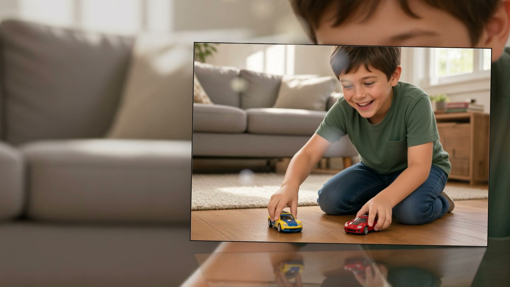<figcaption>Pulse</figcaption></figure>



<figure>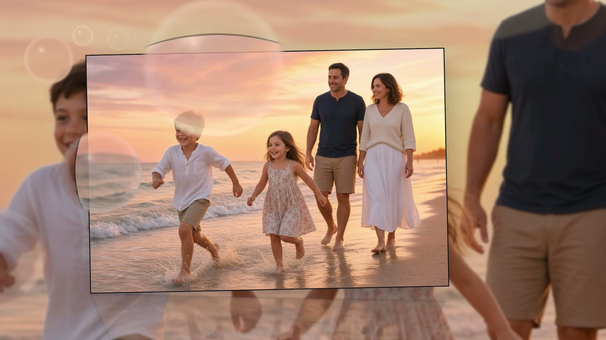<figcaption>Refract Bubbles</figcaption></figure>



<figure><figcaption>Sparkle</figcaption></figure>



<figure>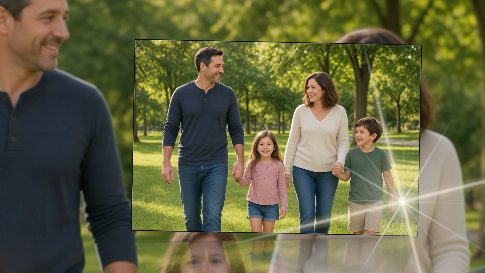<figcaption>Starburst</figcaption></figure>



<figure>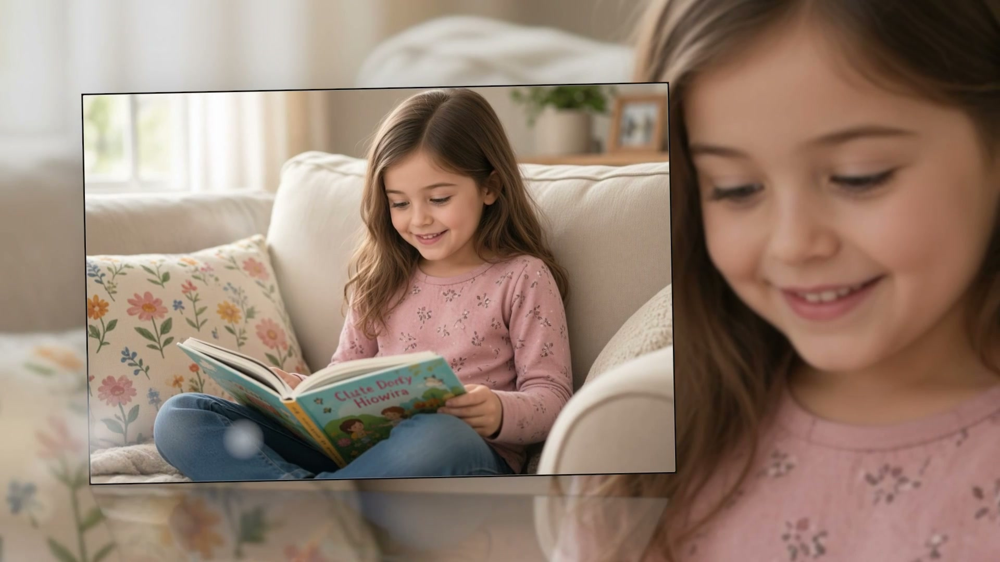<figcaption>Sweep</figcaption></figure>



<figure>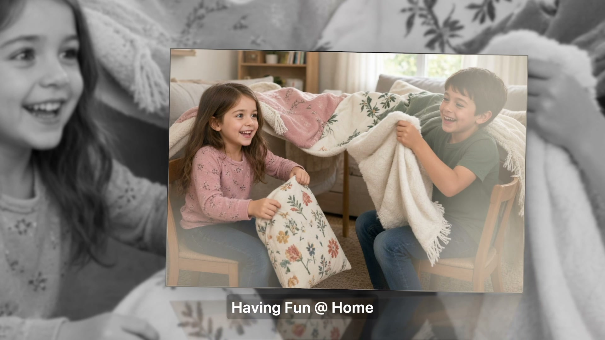<figcaption>Veiling Glare</figcaption></figure>



<figure>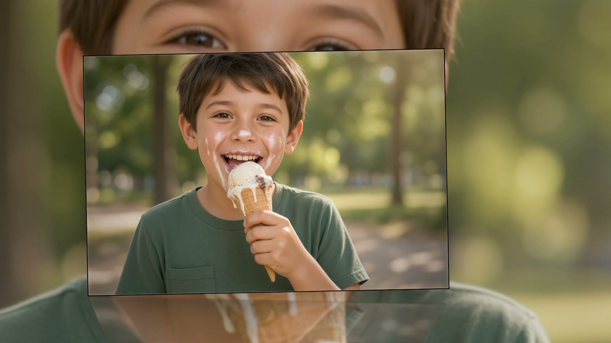<figcaption>Vignette</figcaption></figure>



A photo plays **at most one** pooled lens effect. Choice is stable from the photo’s seed.

- **Randomize Selected on** (how every Look leaves it): every checked box has **equal odds**; **How often** (default **70%**) is how many photos get one at all. Groups a bit more often. **Refract Bubbles** plays as a 2–3 slide take when it wins, and wins fewer anchors so its screen time stays near a fair share.
- **Randomize Selected off**: Vignette and optical accents (Bokeh, 50mm Prime, Ghosting, Veiling Glare, Starburst, Anamorphic Streaks) can paint on **every** photo instead of taking the slot. Checking **Refract Bubbles** puts them all back into one draw (bubbles never stack). **How often** stays enabled when Refract Bubbles is on.

**Bokeh / Sweep / Pulse** are three styles of the same bokeh-circle effect (each takes a pool slot). Anything you check yourself joins the rotation on equal odds — there is no cap of three.

If Randomize is on and **no other lens boxes** are checked, MemoryString draws one stable optical effect per photo from the full pool. Atmosphere and film grain / fringe / scratches are never in that pool.

**Studio:** right-click a Timeline or Library slide → **Lens Effect** (under Slide Transition) to pin effects on that slide or the whole multi-photo group. Current effects are checked. **Refract Bubbles** is scenery: consecutive slides (or consecutive seats) with Bubbles checked share one field; other pins still stack. Unchecking Bubbles on one slide drops only that slide. Pins survive Look re-deals. Essential does not show this menu.

On a group window, vignette and light leak ride the whole open once. Atmosphere and Decals also paint on Photo Stack / Carousel / Ribbon / Filmstrip windows. Grain and scratches stop once the closing fade owns the frame.

Plate, Ambience, Film, and Atmosphere & Decals stay on [Customize](customize.md).

## Anamorphic Streaks (when checked)

Horizontal blue/amber light bars across the stage (backdrop and card), steered off the subject (center of interest).

Presets: **Subtle Cinema** (default) · **Strong Anamorphic** · **Vintage Film** · **Blue Heavy**

Knobs: **Streak Length**, **Intensity**, **Color Split**, **Softness**

On **Noir** / **B&W**, streaks keep their shape as **plain light bars** (not blue/amber).

## Refract Bubbles (when checked)

Glassy spheres that magnify and bend the photo, kept to the backdrop and sides so they stay off the subject.

**Look** menu: **Subtle Bubbles** · **Dreamy** · **Strong Refraction** (default) · **Vintage Soap**

Knobs: **Count**, **Size**, **Speed**, **Refraction**, **Rainbow**. Count, size, speed, and rainbow stay editable after a preset.

On **Noir** / **B&W**, bubbles lose the rainbow rim and read as **clear glass**.
