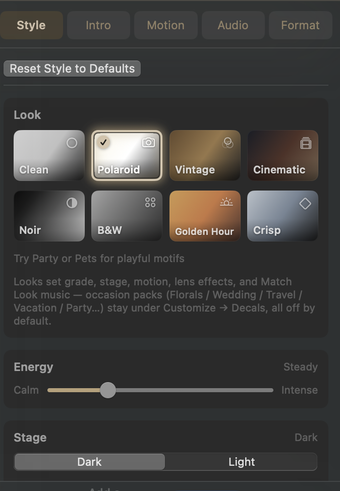
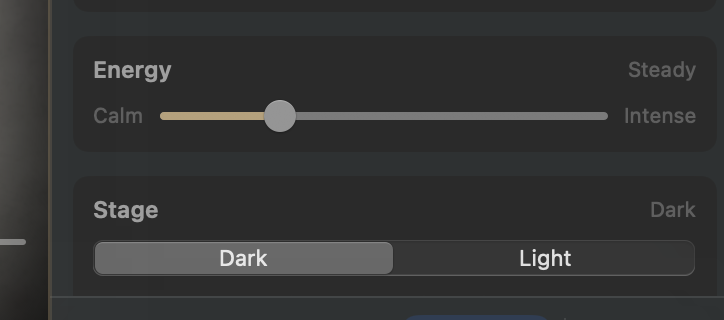

# Looks

Inspector → **Style**. A Look is the movie’s aesthetic: grade, border, stage, backdrop, lens deal, Photo Size, transition mix bias, Match Look music, and which multi-photo groups run.

**⌘Z** undoes Style changes. **Reset Style to Defaults** restores this tab (and caption *style*, not caption *text*). Once captions exist, that control becomes a menu: **Reset styles only** or **Reset styles and clear [N] captions…**.

## The eight chips

Clicking a chip re-populates **Motion → Transitions Mix**, **re-deals** single-slide cuts from that mix’s bias, and applies that Look’s group settings. Hand-picked Motion checkboxes are discarded.

**Click the same Look again** to roll a new deal: a fresh three lens effects (every Look except **Clean**), a new mix of single-slide cuts, and a new Match Look bed if that playlist is still the untouched auto soundtrack. Pins you set under Studio **Lens Effect** survive. Atmosphere and Decals stay **None** unless you picked them.

Editing **Customize…**, **Stage**, **Photo Size**, or **Motion** switches the chip to **Custom**.

Energy, output format, intro on/off, intro text, a background still you already chose, and per-photo overrides are not reset. A Look **does** skin the intro card.

Looks never turn **Atmosphere** or **Decals** on.

A Look that enables several light effects does not play them all on every photo — see [Customize](customize.md).

### Clean

*Nothing between you and the photo.* Chalk white matte, soft contact shadow outside the mat (not a dark rim), **Large** Photo Size, **colored backdrop**, **Gentle** cuts, no film damage, no light effects. Stacks + carousel at Motion defaults; **Perspective Pair** every 6; ribbon rare.

### Polaroid

*Instant prints on a table.* Fat white paper matte with a heavier bottom margin, subtle curl, soft settle glow, gentle wind, plastic vignette, whisper grain. **Large** Photo Size, **Playful** bias. Dense stacks every 3 (size 5); carousel every 6; **Perspective Pair** every 8.

### Vintage

*Aged album page.* Heavy black mat, rough torn edge, light curl, warm leak, **grayscale backdrop**, heavy grain / fringe / scratches, **Large** Photo Size, **Gentle** cuts. Sparse stacks + ribbon; **Perspective Pair** every 7; Filmstrip on. (Leaves stay an opt-in Atmosphere pack — not auto-enabled.)

### Cinematic

*Anamorphic and locked off.* Hairline black frame, strong shadow, soft floor reflection, fine grain, coloured leak, **random backdrop**, the widest lens deal of any Look (~3 from Flare / Ghosting / Orbs / 50mm Prime / Pulse / Starburst / Sweep / Veiling Glare / Anamorphic Streaks / Vignette / Bokeh; **How often** default 70%), **Dramatic** cuts, **Large** Photo Size. Carousel + ribbon lead; **Perspective Pair** every 8; Filmstrip every 8; **Scatter & Settle** every 8, thrown full and wide.

### Noir

*Moody photographic black-and-white.* Softened true-mono plate grade (open midtones — not crushed poster blacks), black frame, strong shadow, vignette + light grain, sharp corners, **Large** Photo Size, **Gentle** cuts. Plate **and** backdrop wash stay mono so the stage matches the print; mats and card backs stay **white or black** paper only (**Customize → Plate → Photo Border**), never cream stock. **Perspective Pair** every 7. A step punchier than neighbouring **B&W**. Optical Bokeh stays off (mono Looks never ship it). **Anamorphic Streaks** keep their shape as plain light bars instead of blue/amber; **Refract Bubbles** lose their rainbow rim and read as clear glass.

### B&W

*Soft documentary grayscale.* Gentler true-mono plate grade with open midtones — cleaner and softer than **Noir**, no colour cast. White mat, soft shadow, rounded corners, whisper grain, **Large** Photo Size, **Gentle** cuts. Optical Bokeh stays off; colour accents go neutral as they do on Noir. Same mono rule: wash follows the grayscale look; mats / card backs are **White** or **Black** paper only. **Perspective Pair** every 8.

### Golden Hour

*Warm late-day colour.* Warm plate lift with soft highlight roll-off (colour stays — not sepia Vintage), white mat, subtle curl, soft reflection + settle glow, gentle wind, warm leak, stage sun wash, **Large** Photo Size, **Gentle** cuts. Deals ~3 from Flare / Veiling Glare / Orbs / Sweep / Vignette / Refract Bubbles / Bokeh. **Perspective Pair** every 8.

### Crisp

*Cool editorial snap.* Cool-neutral plate grade with open midtones, thin white frame, strong shadow, sharp corners, vignette, **Large** Photo Size, **Dramatic** cuts. **Perspective Pair** every 8; Filmstrip every 8.

## Energy

Header band: **Calm · Steady · Lively · Energetic · Intense**. Slider from **Calm** to **Intense**. Biases motion and pacing. Energy never clears hand-picked Motion checkboxes.

Above roughly **93% Energy**, **Spiral-in** and **Reveal from depth** cannot play (boxes dim). If they were the only kinds checked, the movie falls back to Ken Burns while Energy stays that high.

## Stage

**Dark** (black void) or **Light** (cream gallery). Behind every plate, wash, seam, the end fade, and the intro card’s plate / Matte frame chrome so Light never leaves a black scrap on cream. The eight Looks pick **Dark** by default. Changing Stage yourself also marks Style as Custom.

## Photo Size

Word labels only: **Smallest · Small · Medium · Large · Largest** (not a percentage readout). Those five stops span **60%** at Smallest through **98%** at Largest — the resting card matches the stop. Default for every Look is **Large**. A still can still grow a little past rest as slow zoom plays out.

Sets hero / single-slide short-edge fill. Every single-slide cut keeps that full size. Group heroes take Photo Size into account; a group may soft-fit under the label so it stays on stage — **single-slide heroes are never flattened to spare a group.** Social Safe clamps Photo Size to about **85–98%**.

## Captions on this tab

Bulk Auto Caption / Clear, and (Studio) **Type & Placement**. See [Intro and captions](../intro-captions.md).
