# Looks

A **Look** sets the whole movie style from one chip in Inspector → **Style**: grade, border, stage, backdrop, lens effects, Photo Size, transitions, music mood, and which multi-photo groups run.

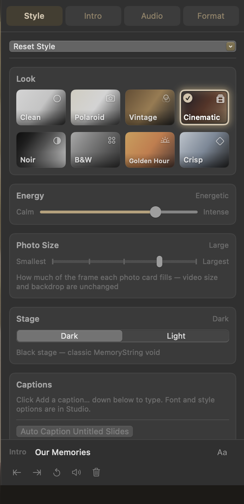

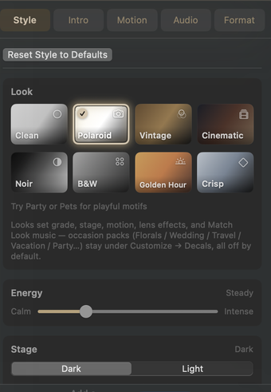

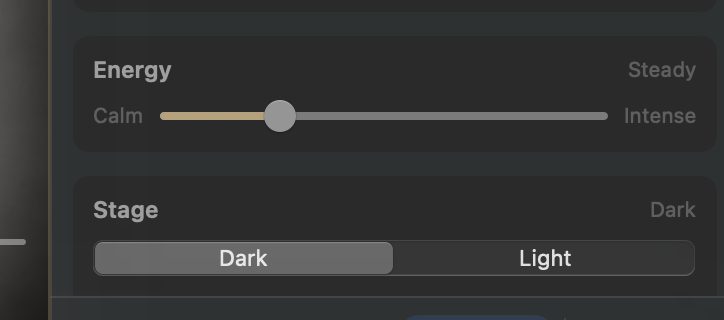

**⌘Z** undoes Style changes. **Reset Style to Defaults** restores this tab (caption style, not caption text). With captions present, choose **Reset Styles Only** or **Reset Styles and Clear [N] Captions…**.

## The eight chips

Click a chip. MemoryString deals transitions from that Look's set and applies group settings for that Look. Hand-picked Motion checkboxes are replaced.

**Click the same Look again** for a new random deal: lens effects (every Look except **Clean**), transitions, and Match Look music if the playlist is still auto-seeded. Pinned **Lens Effect** on slides survive.

Editing **Customize**, **Stage**, **Photo Size**, or **Motion** switches the chip to **Custom**.

Energy, export format, intro on/off, intro text, chosen intro background, and per-photo overrides are not reset. A Look **does** change intro card styling.

Looks do not turn on **Atmosphere** or **Decals** by themselves.

A Look with many lens boxes still plays **at most one** lens effect per photo. See [Customize](customize.md#lens-effects).

### Clean

Minimal style. White matte, soft shadow, **Large** Photo Size, colored backdrop, soft transitions (Ken Burns, depth dissolve, reveal from depth). Stacks + carousel at defaults; **Perspective Pair** every 6.

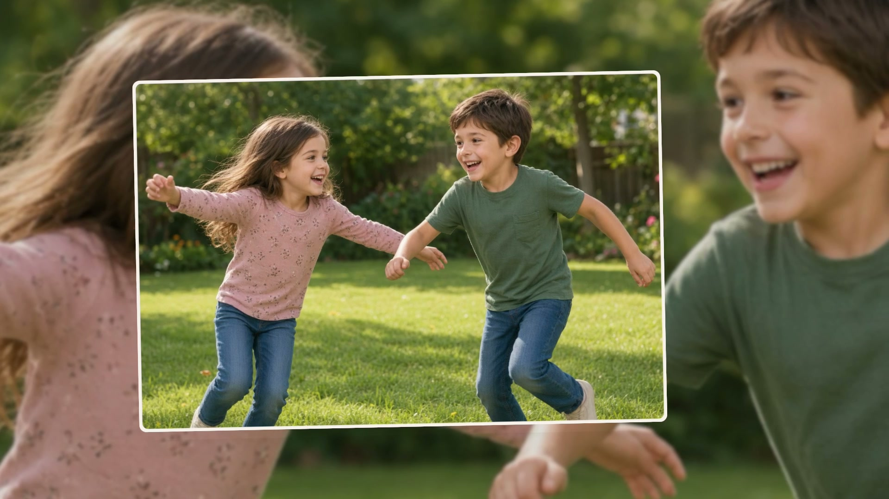

### Polaroid

Instant-print feel. White matte with thick bottom margin, curl, gentle wind, playful transitions (card flip, slide, sparks, contact sheet). Dense stacks; carousel; **Perspective Pair** every 8.

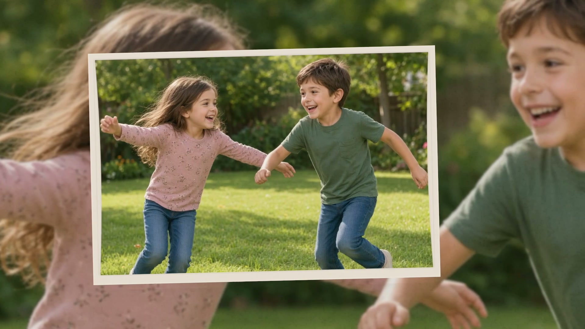

### Vintage

Aged album. Black mat, torn edge, warm leak, grayscale backdrop, grain and scratches, soft transitions (layers, same-photo fan, card flip). Sparse stacks and ribbon; Filmstrip on.

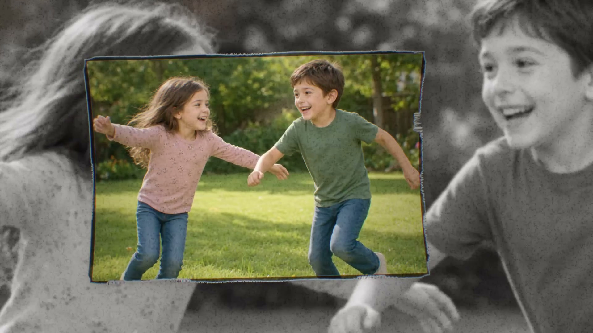

### Cinematic

Wide cinematic grade. Thin black frame, strong shadow, fine grain, dramatic transitions (spiral-in, punch-in, accordion), **Large** Photo Size. Carousel and ribbon; Filmstrip and **Scatter & Settle** on some cadences.

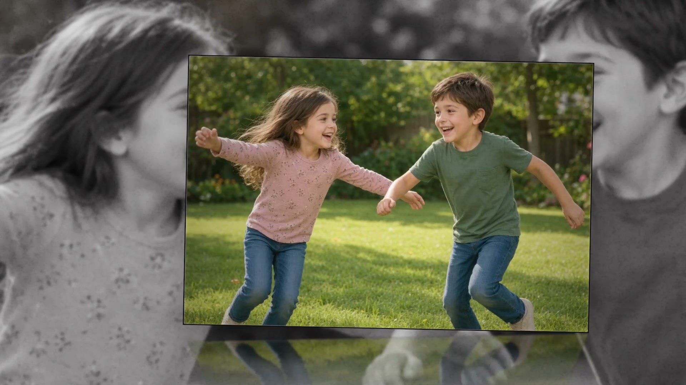

### Noir

Moody black-and-white. Soft mono grade, black frame, vignette, soft transitions; no spark trails. **Perspective Pair** every 7. Mats stay white or black paper.

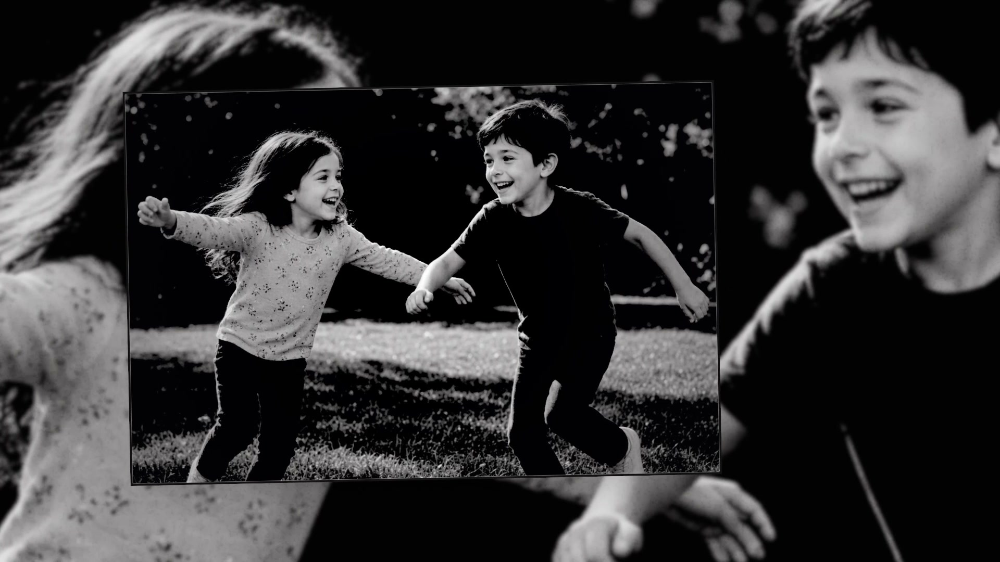

### B&W

Soft documentary grayscale. White mat, rounded corners, soft transitions; no spark trails. **Perspective Pair** every 8. Gentler than **Noir**.

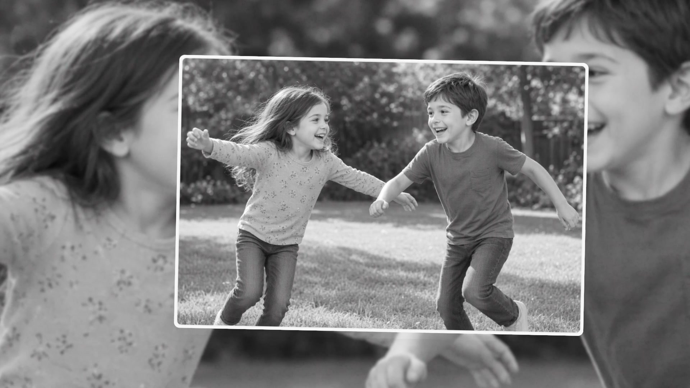

### Golden Hour

Warm late-day color. White mat, warm leak, stage sun wash, soft transitions. **Perspective Pair** every 8.

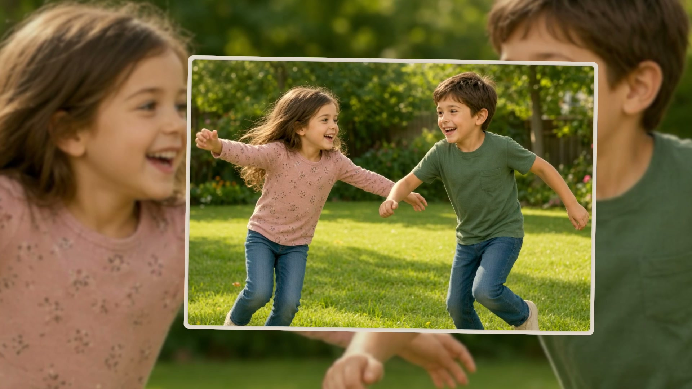

### Crisp

Cool editorial look. Thin white frame, strong shadow, dramatic transitions (punch-in, flying card, spiral-in). **Perspective Pair** and Filmstrip every 8.

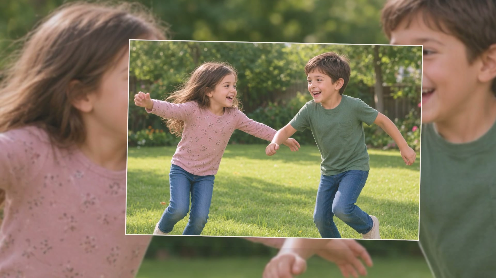

## Energy

Slider from **Calm** to **Intense**. Labels: **Calm · Steady · Lively · Energetic · Intense**.

Photo still duration scales with Energy — about **7.6s** at Calm, **4.0s** at default, **2.0s** at Intense. **Intro** uses separate timing: about **7s / 6s / 4s**. Energy does not clear hand-picked Motion checkboxes.

**Spiral-in** and **Reveal from depth** play at every Energy. Their slides run a little longer so the slow wind-in still lands.

## Photo Size

How large the hero photo sits on stage. Inspector → **Style**, under Energy. Labels: **Smallest · Small · Medium · Large · Largest**. Default for every Look: **Large**.

Sets size for single slides. Groups may fit slightly smaller to stay on stage. [Social Safe](../export.md#social-safe) clamps Photo Size to about **85–98%** on tall exports.

## Stage

**Dark** (black) or **Light** (cream gallery). Inspector → **Style**, under Photo Size. Looks default to **Dark**. Changing Stage marks Style as **Custom**.

**Studio:** **Stage Intensity** slider under Dark / Light controls how strong the stage background reads. Photos in front are not dimmed. Preview and export match.

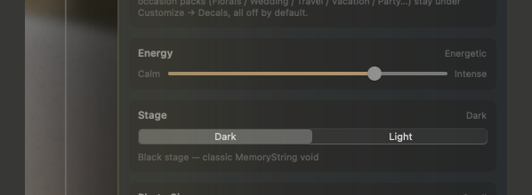

**Dark**

<figure>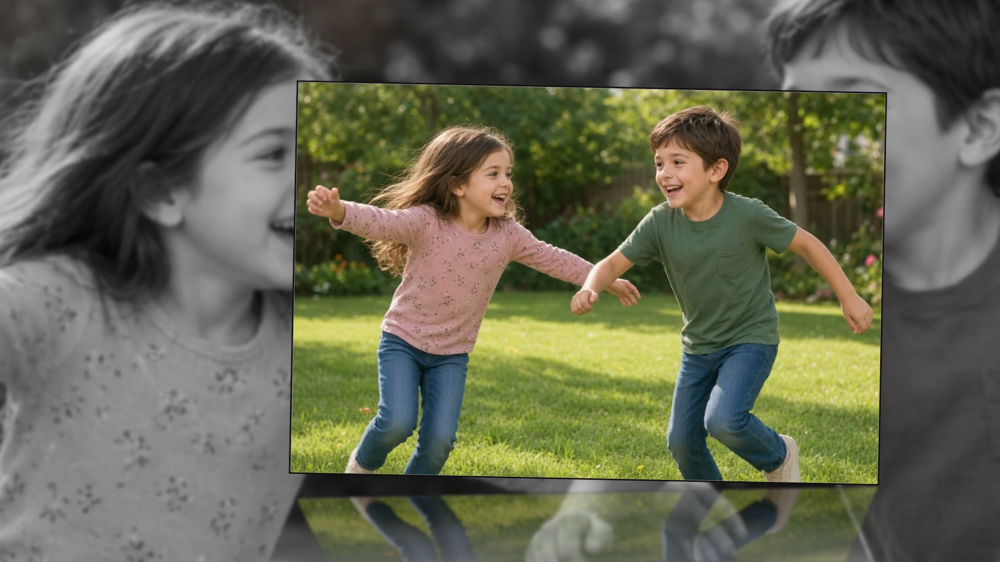<figcaption>Dark stage</figcaption></figure>

**Light**

<figure>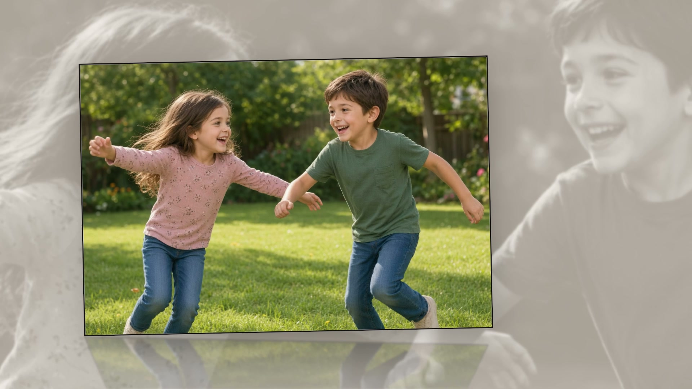<figcaption>Light stage</figcaption></figure>

## Captions on this tab

Bulk **Auto Caption** / **Clear**, and (**Studio**) **Type & Placement**. See [Intro and captions](../intro-captions.md#set-a-caption-in-the-inspector).
