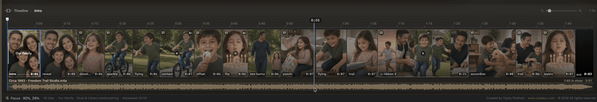

# Timeline

The strip under the preview shows time, slides, and music. Use it to reorder, trim, and scrub.

## Layout

1. **Time ruler** — click or drag to seek
2. **Photo lane** — slides, intro, and group cells. Hover a cell to peek; move off the strip and that moment stays on the preview. Hover is ignored while playing
3. **Audioline** — soundtrack clips

The header shows **Timeline**, the selected clip **name**, and zoom. **1.0×** fits the whole project. Empty strip: **Nothing on the timeline yet**.

### Timeline height

Drag the **thin seam** between the preview and **Timeline** **up** to grow the photo lane, **down** to shrink. Height is remembered. **⌘+** / **⌘-** scale strip height with UI text size.

### Zoom and gestures

- **Zoom slider** — live zoom; all the way left for full overview
- **Pinch** on trackpad
- **Scroll wheel** over **Timeline** — up zooms in, down out
- **⌥⌘+** / **⌥⌘-**
- **Two-finger pan** or horizontal scroll
- **Middle-mouse drag** to pan

**⌘+** / **⌘-** / **⌘0** change UI text size for **Library** cards and strip height — not zoom.

Long projects scroll instead of squeezing cells. During playback the strip follows the playhead.

Dragging the playhead shows a blue time chip. **←** / **→** nudge (~0.1s); **⇧** for larger steps.

## Reorder and trim

Drag clips on the photo lane. From **Library**: gap = insert/move; drop on slide or group seat = **Replace**; intro tile = intro background. Music reorders on the **Audioline**.

First click on a group selects the whole window. Second click on a thumb selects one seat. See [Organizing](organizing.md#in-group-photos-and-videos).

Select a clip and drag **edge grips**:

- **Videos** — trim with frame feedback; **2 second** minimum. **Reset Video Duration** restores full file
- **Music** — edge drag auditions that point. **Set Start Here** / **Set End Here** at playhead. See [Music → Audition the Audioline](music.md#audition-the-audioline). **Reset Length** restores auto-skipped edges or full file
- **Stills** — edge drag changes hold time

Right-click a photo or video on the photo lane:

- **Slide Transition** — pick a cut or **Random** (groups: **Group Transition** / **Ungroup**)
- **Lens Effect** — Studio only
- **Rotate & Flip**
- **Set Duration…** (**⌘D**). Videos: **Timing** submenu with duration and **Set Start Here** / **Set End Here**
- **Set Caption** (**⇧⌘C**)
- **Clear Caption**
- **Move to Outtakes**
- **Remove from Project** (**⌘⌫**)

On a **grouped seat**, the top of the menu applies to **that photo**, plus **Auto Trim videos in this group** and **Reset Video Durations in this group**. Header shows **Photo 2 of 5 · Ribbon**. Below: **Group Transition**, **Entire group ▸** (rotate, lens, **Set Duration…**, **Move N photos to Outtakes**, **Remove N**), and **Ungroup**.

**Set Duration…** on a group opens **Group Length**. It sets the whole group, the same as dragging the group's edge. A video seat inside does not cap it. Typing a length in the Inspector does the same.

Videos also: **Mute Video Sound** / **Unmute Video Sound**, **Auto Trim**, **Reset Video Duration**

**Auto Trim** — about four seconds from the middle, face nudge ~70% success. Not on import. Undo **⌘Z**. See [Auto detection](auto-detection.md#auto-trim).

Right-click video or music for **Set Start Here** / **Set End Here** and reset duration/length.

Inspector clip footer has the same trims for selected video or soundtrack.

**Auto Caption** is not on this menu — use **Library** captions bubble, **Edit**, Style → Captions, or **Generate**.

Right-click selects the clip under the pointer and seeks the playhead there. **Esc** deselects clips and music tracks.

Intro cell: **Set Intro Title**, **Set Background Image**, **Disable Intro Slide**, (Studio) **Lens Effect**, **Rotate & Flip** with background, **Reset Center of Interest** with background.

## Motion → Timeline (Studio)

Inspector → **Motion** → **Timeline**:

- **Sort by Date Taken**
- **Shuffle Slides**
- **Shuffle Transitions**
- **Reset Slide Durations**

Also on **Library** **⋯**. Intro stays first. **⌘Z** undoes.

## End card

Every show ends with a **MemoryString** credit. On the photo lane this is a trailing **end** cell. You can select it but not trim or reorder it like media.

## Groups on the strip

Multi-photo windows collapse to one cell (stack, carousel, ribbon, pair, filmstrip, scatter). The cell may show multiple thumbs and video mute badges. See [Multi-photo groups](motion/groups.md#timeline-library).
