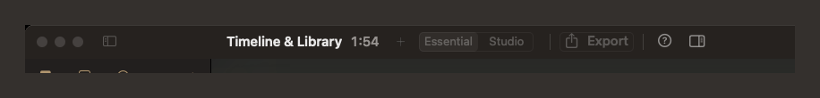
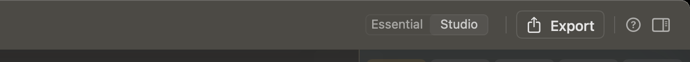
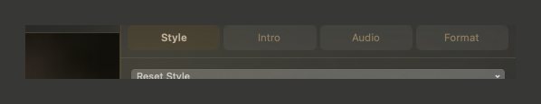
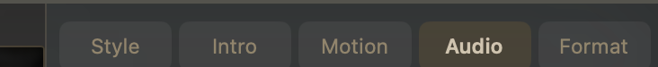
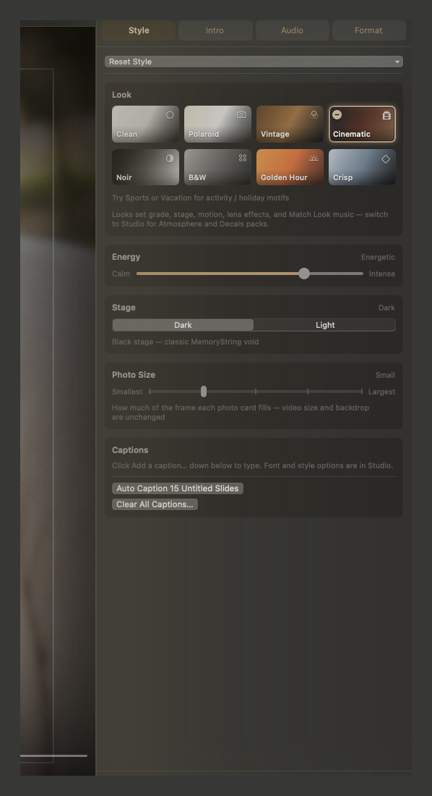

# Essential and Studio

Two depths of the same desk. The toolbar segmented control switches **Essential** and **Studio** — same project file; Studio simply opens more drawers.

**View → Switch to Studio Mode** / **Switch to Essential Mode** does the same.

## Inspector tabs

Essential keeps the everyday tabs — **Style, Intro, Audio, Format**. Studio adds the motion lab: **Motion**.

## What changes

What Essential hides, and what Studio unlocks.

| | Essential | Studio |
| --- | --- | --- |
| Inspector tabs | Style, Intro, Audio, Format | those plus **Motion** |
| Style → **Customize…** | Hidden | Plate, Ambience, Lens Effects, Film, Atmosphere & Decals |
| Captions | Type in the clip bar; bulk Auto Caption / Clear | plus **Type & Placement** (font, color, size, align, motion, placement, shade) |
| Intro background | Choose / remove a still | plus Dim, Start zoom, Slow Zoom, Soften, Color / Grayscale |
| Intro **Text** (font, color, size, align, outline, shadow) | Hidden — type in the title field | Shown |
| Intro Card & Motion | — | Frame, Motion, Lens, Decoration |
| Smooth play | Warms automatically on **Play**; **Stop** while warming | **Auto-warm on Play**, **Warm Now**, **Stop** |
| Per-slide **Lens Effect** (right-click) | Hidden | Timeline / Library / intro |
| Export **Quality** | Email · Share · Screen · Master | same, plus Mbps readout |

Looks, Energy, Stage, Photo Size, Format, music, import, and export still work in Essential. Not a lesser app — a quieter one.

**Essential import:** if the Library was empty or already **Oldest First**, new stills auto-sort **Oldest First (Story Order)**. Studio does not. **⌘Z** undoes it.


**MemoryString → Reset All Settings…** restores app preferences only (mode, text size, chrome layout, library badges, walkthrough flag). It does **not** change the open slideshow.

