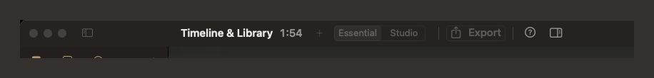
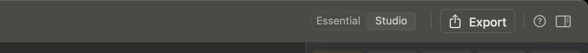
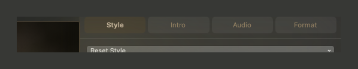
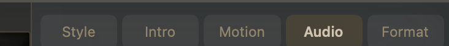
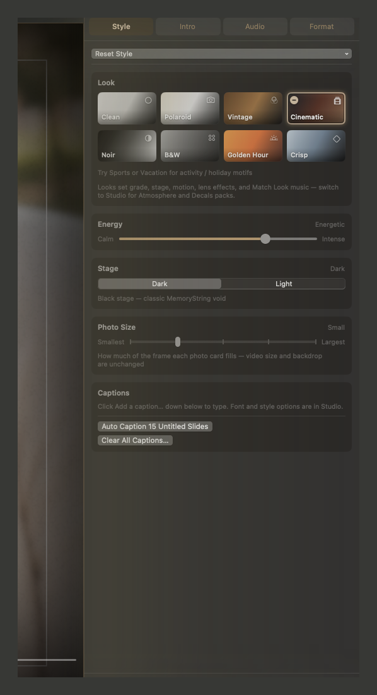

# Essential and Studio

**Essential** and **Studio** are two levels of the same app. The toolbar segmented control switches between them. The project file is the same. **Studio** shows more Inspector tabs and options.

**View → Switch to Studio Mode** / **Switch to Essential Mode** does the same.

## Inspector tabs

**Essential** shows **Style**, **Intro**, **Audio**, and **Format**. **Studio** adds **Motion**.

## What changes

| | Essential | Studio |
| --- | --- | --- |
| Inspector tabs | Style, Intro, Audio, Format | those plus **Motion** |
| Style → **Stage Intensity** | Hidden | Slider under Dark / Light |
| Style → **Customize** | Hidden | Plate, Ambience, Lens Effects, Film, Atmosphere & Decals |
| Captions | Type in the clip bar; bulk Auto Caption / Clear | plus **Type & Placement** (font, color, size, align, motion, placement, shade) |
| Intro background | Choose / remove a still | plus Dim, Start zoom, Slow Zoom, Soften, Color / Grayscale |
| Intro **Text** (font, color, size, align, outline, shadow) | Hidden — type in the title field | Shown |
| Intro Card & Motion | — | Frame, Motion, Lens, Decoration |
| Smooth play | Auto-warms on **Play**; **Preparing smooth playback** card until the first five photo slides are ready; **Stop** while warming | Auto-warms on **Play** without blocking; **Warm Now** and **Stop** on the transport row |
| Per-slide **Lens Effect** (right-click) | Hidden | Timeline / Library / intro |
| Export **Quality** | Compact / Share / High / Best (slider; default **Share**) | same slider, plus target Mbps |

Looks, Energy, Stage, Photo Size, Format, music, import, and export work in both modes.

**Essential import:** if the **Library** was empty or already **Oldest First**, new stills auto-sort **Oldest First (Story Order)**. **Studio** does not. **⌘Z** undoes it. **Keep Best Shots** and **Auto Trim** work in both modes ([Auto detection](../auto-detection.md#keep-best-shots)).


**MemoryString → Reset All Settings…** restores app preferences only (mode, text size, chrome layout, library badges, walkthrough flag). It does **not** change the open slideshow.

