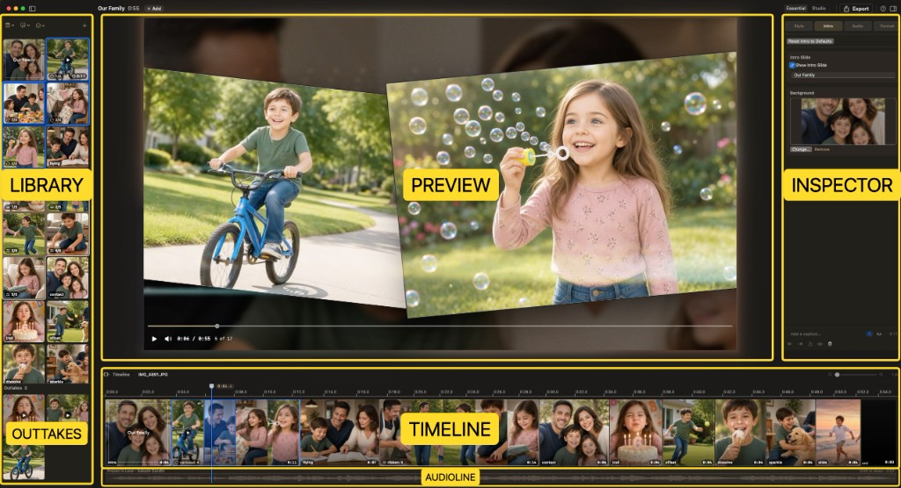

# The Studio

You step into the Studio.

This wasn’t built just to produce the best slideshows you’ve ever made. It was built so that working on them feels like something. The oak and the gold are the room you live in while you create.

Most apps treat the workspace like a factory floor. We treated it like a place you’d want to spend an evening. Because you will.

## The panes

The Studio is built around Library, Outtakes, Preview, Inspector, Timeline, and Audioline.

| Pane | Where | What it is |
| --- | --- | --- |
| **Library** | Left | **Takes** — the show grid. Empty: **Nothing in library yet**. |
| **Outtakes** | Left, under Takes | Parked photos — in the project, off the show. Empty: **Nothing discarded.** |
| **Preview** | Center | The movie, plus Play / scrub. Empty: **Add photos & videos** plus *Drop photos and videos to start a memory*. Opening a project fogs **The story continues…**. |
| **Inspector** | Right | Style, Intro, Motion, Audio, Format |
| **Timeline** | Bottom | Photo lane — slides and groups. Empty: **Nothing on the timeline yet**. |
| **Audioline** | Under the Timeline | Soundtrack clips and their waveforms (the music lane). |

## Toolbar

The useful stuff sits on the right — mode, export, help, and the Inspector toggle.

- **Essential** / **Studio** — how many controls you see ([next page](essential-studio.md)). First-run walkthrough marks sit on this control, **+**, and **Export**.
- **Export** — Export Movie dialog
- **?** — MemoryString Help (**⌘/**)
- Inspector toggle — show or hide the right column (**⌥⌘I**)

Toolbar **+** (near the project name) is **Photos & Videos…**, **Import from Photos…**, **Music…**, and **Royalty-Free Library…**.

## Library

Photos and videos for this show. The column splits into **Takes** (the show grid) and **Outtakes** (in the project, off the show). Calendar sort, captions bubble, **⋯** (**Keep Best Shots…**, **Auto Trim Videos…**, and more), and **+** sit on the header. **File → Import from Photos…** is on **+** too.

**View → Toggle Sidebar** (**⌃⌘S**) slides the column open and closed. Drag the **vertical divider** on its right edge to widen or narrow it — it snaps to whole columns of cards. The width is remembered.

More: [Library](../library.md).

## Outtakes

Parked photos — in the project, not on the show. Keep Best extras land here, or anything you **Move to Outtakes** / drag down from Takes or the filmstrip (a move, not a copy).

Click an outtake to select it; the playhead stays on the current movie slide. Drag up into Takes or the filmstrip to put it back on the show. Empty: **Nothing discarded.**

More: [Library → Outtakes](../library.md#outtakes).

## Preview

The stage is the movie. Under it, the transport — Play, `current / total`, slide **N of M**, and the scrub bar.

**Space** plays. Click or drag the bar to scrub. **←** / **→** nudge.

More: [Preview](../preview.md).

## Inspector

Style, Intro, Audio, and Format in **Essential**. **Studio** adds **Motion** and the deeper Customize drawers. Whatever tab you’re on, the bottom strip stays: caption (or intro text), **Generate**, **Aa**, and trim / mute / volume / remove when a video or soundtrack is selected.

The Inspector toggle (**⌥⌘I**) slides the column open and closed — it does not remount the preview.

More: [Essential and Studio](essential-studio.md).

## Timeline

Photo lane — slides, intro, and group cells. The **Audioline** sits underneath. Drag the **thin seam above the Timeline** up or down to grow or shrink the filmstrip (up to about **160** points extra). That height is remembered. The zoom slider (minus / plus magnifying glass) scales the strip **live**.

**⌘+** / **⌘-** still scale Timeline strip height (and Library cards) with UI text size; the drag adds extra height on top of that base.

More: [Timeline](../timeline.md).

## Audioline

The **Audioline** is the music lane under the photo strip — soundtrack clips and their waveforms. Soundtrack lives here and on Inspector → **Audio**, not in the Library.

Drag clips to line them up. Trim with edge grips. Waveform **narrows at the fade edges**.

More: [Music](../music.md#arrange-on-the-timeline).

## Text size

Chrome, not captions. **View → Increase / Decrease / Default Text Size** (**⌘+** / **⌘-** / **⌘0**) scales app UI, **Library cards**, and **Timeline** strip height together — not slide captions.

## Walkthrough

Forgot the first-run tour? **Help → Show Walkthrough** plays it again. Marks sit on the live title-bar **+**, Essential/Studio, and **Export**. Seven stops: **Bring in moments** → **Your Library** → **Shape the story** → **Watch it come alive** → **Make it yours** → **Share your memory** → **Essential or Studio**. Full lines: [In-app Help](../help.md).

**MemoryString → Reset All Settings…** restores app preferences only (mode, text size, chrome layout, library badges, walkthrough flag). It does **not** change the open slideshow — your photos stay put; only the chrome forgets your habits.
