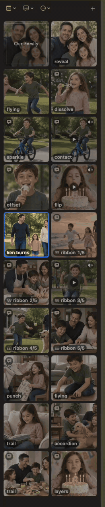
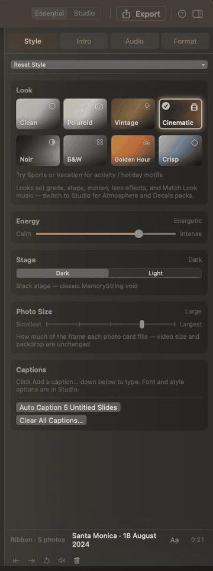
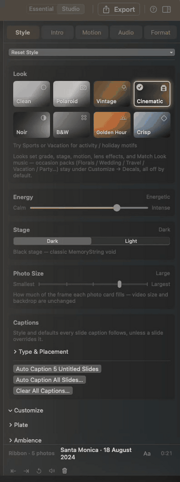
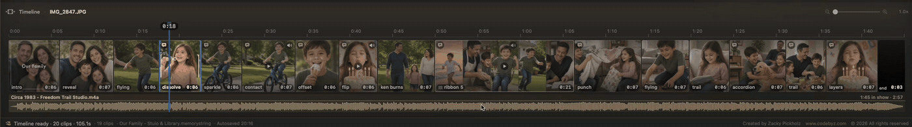
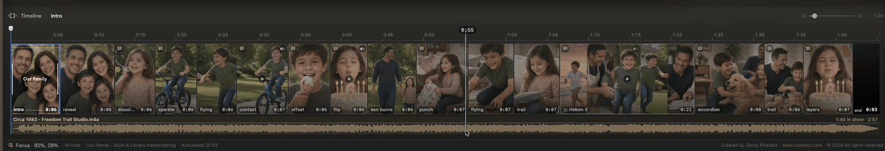

# The Studio

You step into the Studio.

This wasn’t built just to produce the best slideshows you’ve ever made. It was built so that working on them feels like something. The oak, the gold, the ambient light spilling from the preview panel onto the chrome around it — none of that is decoration. It’s the room you live in while you create.

Most apps treat the workspace like a factory floor. We treated it like a place you’d want to spend an evening. Because you will.

## The panes

The Studio is built around four panes: Library, Preview, Inspector, and Timeline.

| Pane | Where | What it is |
| --- | --- | --- |
| **Library** | Left | Photos and videos in this project |
| **Preview** | Center | The movie, plus Play / scrub |
| **Inspector** | Right | Style, Intro, Motion, Audio, Format |
| **Timeline** | Bottom | Photo lane + music lane |

## Toolbar

The useful stuff sits on the right — mode, export, help, and the Inspector toggle.

- **Essential** / **Studio** — how many controls you see ([next page](essential-studio.md))
- **Export** — Export Movie dialog
- **?** — MemoryString Help (**⌘/**)
- Inspector toggle — show or hide the right column (**⌥⌘I**)

Toolbar **+** (near the project name) is **Photos & Videos…**, **Music…**, and **Royalty-Free Library…**.

## Library

Photos and videos for this show. Calendar sort, captions bubble, **⋯** (**Keep Best Shots…**, **Auto Trim Videos…**, and more), and **+** sit on the header.

**View → Toggle Sidebar** (**⌃⌘S**) slides the column open and closed. Drag the **vertical divider** on its right edge to widen or narrow it; the width is remembered.

More: [Library](../library.md).

## Preview

The stage is the movie. Under it, the transport — Play, `current / total`, slide **N of M**, and the scrub bar.

**Space** plays. Click or drag the bar to scrub. **←** / **→** nudge.

More: [Preview](../preview.md).

## Inspector

Style, Intro, Audio, and Format in **Essential**. **Studio** adds **Motion** and the deeper Customize drawers. Whatever tab you’re on, the bottom strip stays: caption (or intro text), **Generate**, **Aa**, and trim / mute / volume / remove when a video or soundtrack is selected.

The Inspector toggle (**⌥⌘I**) slides the column open and closed — it does not remount the preview.

More: [Essential and Studio](essential-studio.md).

## Timeline

Photo lane on top, music underneath. Drag the **thin seam above the Timeline** up or down to grow or shrink the filmstrip (up to about **160** points extra). That height is remembered. The zoom slider (minus / plus magnifying glass) scales the strip **live**.

**⌘+** / **⌘-** still scale Timeline strip height (and Library cards) with UI text size; the drag adds extra height on top of that base.

More: [Timeline](../timeline.md).

## Text size

Chrome, not captions. **View → Increase / Decrease / Default Text Size** (**⌘+** / **⌘-** / **⌘0**) scales app UI, **Library cards**, and **Timeline** strip height together — not slide captions.

## Walkthrough

Forgot the first-run tour? **Help → Show Walkthrough** plays it again: Bring in moments → Your Library → Shape the story → Watch it come alive → Make it yours → Share your memory → Essential or Studio.

**MemoryString → Reset All Settings…** restores app preferences only (mode, text size, chrome layout, library badges, walkthrough flag). It does **not** change the open slideshow — your photos stay put; only the chrome forgets your habits.
